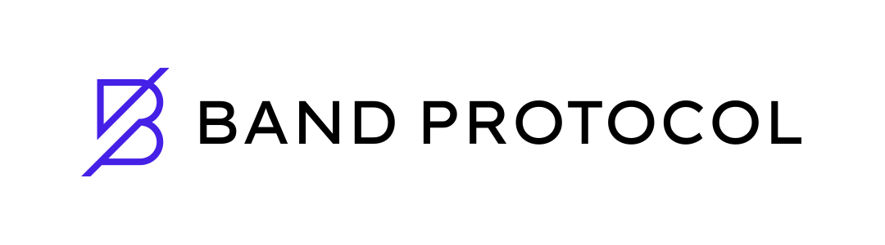

# Tunnel TSS Router Contracts

<div align="center">



[](https://opensource.org/licenses/Apache-2.0)
[](https://github.com/bandprotocol/tunnel-tss-router-contracts/actions/workflows/test.yml)

</div>

The Tunnel-TSS-Router is an innovative relaying solution that connects EVM networks with Band Protocol's price feeds data more efficiently than the current Bridge smart contract. It leverages threshold signature technology and a custom signing procedure to minimize proof size and verification operations, resulting in significant gas savings.

## Background
The current Bridge smart contract requires extensive EVM operations for lite client verification, leading to high gas consumption. This inefficiency stems from several factors such as:

1. Storing and retrieving validators with voting power
2. Verifying multiple signatures
3. Computing Merkle tree hashes
4. Encoding Tendermint structures

These operations result in high gas costs and slower transaction processing. The Tunnel-TSS-Router addresses these issues by implementing a more efficient verification mechanism using threshold signatures.

## Installation
If you don't have Foundry installed, run the following command to install foundryup, the Foundry toolchain installer:
```sh
curl -L https://foundry.paradigm.xyz | bash
```

## Testing
Run the following command to execute tests:
```sh
forge test -vv
```

## Data Flow
The Tunnel-TSS-Router system consists of multiple coordinated components that work together to securely relay data:

1. A **Relayer** submits data to the `TunnelRouter`
2. The `TunnelRouter` decodes the message and verifies its sequence to prevent replay attacks
3. If the sequence is valid, the data and its signature are forwarded to the `TSSVerifier` for signature validation
4. After successful verification, the message is sent to the `Target Contract` for final processing
5. The `TunnelRouter` withdraws the relaying fee from the `Vault` and transfers it to the relayer
6. If the remaining balance drops below a configured threshold, the Target Contract is marked as **inactive** to prevent further relaying

## Features
Built on threshold signature technology and a custom signing procedure, the project offers several advantages:

1. 🔁 **Efficient Relaying Process**
    - The `TunnelRouter` maintains data integrity by decoding messages and validating sequences
    - The `TSSVerifier` securely validates data authenticity using threshold signatures
    - Fees are automatically withdrawn from the `Vault` and paid to the relayer
    - Account owners can securely withdraw tokens from the `Vault`.

2. ✅ **Reduced Gas Usage**
    - Compact threshold signature scheme minimizes on-chain verification logic
    - Eliminates the need to verify multiple individual signatures

3. ⚖️ **Flexible Fee Models**
    - Supports both GasPrice and PriorityFee models
    - Ensures fair and flexible compensation for relayers across different network conditions
    - Vault-based system manages relayer deposits and withdrawals

4. 🛡️ **Robust Security**
    - Uses TSS to guarantee data integrity and authenticity
    - Prevents unauthorized withdrawals through vault safeguards
    - Sequence tracking prevents message replay and duplication
    - Deactivation logic protects underfunded target contracts from exploitation

5. 🏛️ **Enhanced Decentralization**
    - Eliminates the need for centralized multisig validators

## Deployment Scripts

Before running any deployment scripts, **you must first configure the required environment variables at the top of each script file**. Open the script in an editor, review the list of variables, and set them according to your network and deployment needs. Sample values and their meanings are described below.

---

### `script/deploy_tunnel_router.sh`

This script deploys the full set of Tunnel Router components, including the TunnelRouter, Vault, and TSSVerifier contracts, as well as proxy contracts for both TunnelRouter and Vault to your configured Ethereum-compatible network.

**Step 1: Configure Variables**

Edit the variables at the top of `script/deploy_tunnel_router.sh`. Below is a description of each variable you need to set, along with example values.

| Variable            | Description                                                                  | Example                                      |
|---------------------|------------------------------------------------------------------------------|----------------------------------------------|
| `RPC_URL`           | RPC endpoint of the target Ethereum-compatible chain                         | `https://sepolia.infura.io/v3/XXXX`          |
| `TARGET_CHAIN_ID`   | chain name id on Band                                                        | `chainname-mainnet`                          |
| `RELAYER_ADDR`      | Address(es) of initial relayers, comma-separated if multiple                 | `0xabc123...,0xdef456...`                    |
| `RELAYER_BALANCE`   | Native token value to send to each relayer (for fees)                        | `0.1ether`                                   |
| `PRIORITY_FEE`      | Default tip for priority-fee-based networks                                  | `1wei`                                       |
| `TRANSITION_PERIOD` | Time in seconds for transition period                                        | `172800`                                     |
| `BANDCHAIN_RPC_URL` | RPC endpoint of BandChain node                                               | `https://rpc.laozi3.bandchain.org/`          |
| `OPERATOR_ADDRESS`  | Address that will be set as contract operator, comma-separated if multiple   | `0x0fedcba9876543210fedcba9876543210fedcba9` |
| `REFUNDABLE`        | Whether the Vault will refund fees back to the packet consumer or keeps them | `true` or `false`                            |

_Note: The `PRIVATE_KEY` environment variable (not in file) must also be exported in your shell before running the script._

**Step 2: Run the Script**

```sh
export PRIVATE_KEY=<your_private_key>
bash script/deploy_tunnel_router.sh
```

**Environment Variables:**
- `PRIVATE_KEY`: The private key used to sign the deployment transactions. _This environment variable must be set for the script to work._

**What it does:**
- Sets up the deployment environment with your provided `PRIVATE_KEY`
- Deploys the `TunnelRouter` contract, the `Vault` contract, and the `TSSVerifier` contract
- Deploys proxy contracts for both `TunnelRouter` and `Vault`
- Configures each component to work together in the Tunnel-TSS-Router system

---

### `script/deploy_tunnel_consumer.sh`

This script automates the full deployment of the Tunnel Consumer component. It deploys the PacketConsumer 
contract, also sets up a separate proxy contract that serves as an interface to query the PacketConsumer, and 
initiates the tunnel on BandChain.

**Step 1: Configure Variables**

Edit the variables at the top of `script/deploy_tunnel_consumer.sh` as shown:

| Variable                    | Description                                                                | Example                                      |
|-----------------------------|----------------------------------------------------------------------------|----------------------------------------------|
| `RPC_URL`                   | RPC endpoint of the target Ethereum-compatible chain                       | `https://sepolia.infura.io/v3/XXXX`          |
| `TARGET_CHAIN_ID`           | chain name id on Band                                                      | `chainname-mainnet`                        |
| `TUNNEL_ROUTER`             | Deployed TunnelRouter contract address                                     | `0x1234abcd....`                             |
| `VAULT_BALANCE`             | ETH or coin value to fund the consumer's vault (for fees)                  | `0.05ether`                                  |
| `BANDCHAIN_RPC_URL`         | RPC endpoint for BandChain node                                            | `https://rpc.laozi3.bandchain.org/`          |
| `WALLET_NAME`               | Name of the BandChain wallet                                               | `alice`                                      |
| `BANDCHAIN_KEYRING_BACKEND` | BandChain key storage backend (`os`, `file`, or `test`)                    | `os`                                         |
| `PRICE_INTERVAL`            | Seconds between oracle price reports                                       | `300`                                        |
| `PRICE_DEVIATION_JSON_FILE` | JSON file with allowed price deviation thresholds                          | `deviation.json`                             |
| `FEE_PAYER_BALANCE`         | Amount to send to BandChain fee payer, with denom                          | `1000000uband`                               |
| `OPERATOR_ADDRESS`          | Address that will be set as contract operator, comma-separated if multiple | `0x0fedcba9876543210fedcba9876543210fedcba9` |

_Note: You must also `export PRIVATE_KEY=<your_private_key>` in your shell, as with the router script._

**Step 2: Run the Script**

```sh
export PRIVATE_KEY=<your_private_key>
bash script/deploy_tunnel_consumer.sh
```

**Environment Variables:**
- `PRIVATE_KEY`: The private key used to sign all deployment transactions. _This variable must be set for the script to work._

**What it does:**
- Deploys the PacketConsumer contract (and proxy) to your target EVM chain
- Executes necessary BandChain CLI commands to set up and activate the tunnel linking both chains
- Funds the tunnel on both sides for correct operation

---

**Note:**  
Both of the following accounts must have a sufficient balance of the native token (e.g. ETH) on the target network to cover deployment and operational transaction fees:
- The account corresponding to your `PRIVATE_KEY` (used for deployment on the EVM chain)
- The account used for BandChain interactions (i.e., your Band wallet specified by wallet name or address)

If either account lacks sufficient balance, deployment or subsequent operations may fail.

## Contribution
We welcome and encourage contributions to the project. If you have suggestions or feedback, please open an issue or submit a pull request. We appreciate your contributions and look forward to collaborating to improve the Tunnel-TSS-Router.
