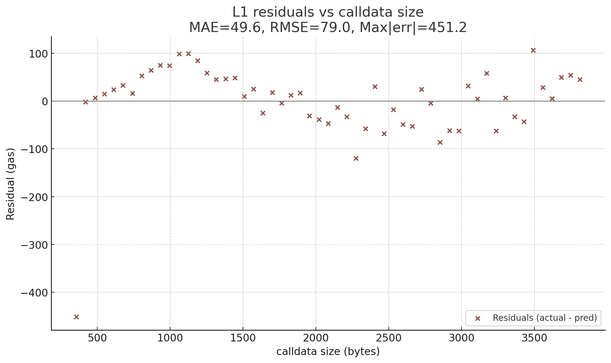

# Estimating Tunnel Relay Gas

### Status & Scope (Work-in-Progress)

> 💡 **Heads-up:** This document is an active working draft. It captures what we’ve tried, what worked, and what still needs decisions. Structure and naming are still being tuned, so please read it as a technical lab note rather than a finalized spec.

This document explains the **Foundry** test design, the **polynomial models** (linear / quadratic / cubic), the **Monte-Carlo** validation, and the **conclusions** for the on-chain environment.

> **Goal.** Let a relayer with *minimal native balance* relay forever by paying the **entire transaction gas** from the **consumer’s vault**.
> We split a relay tx into two parts:
>
> ```
> TotalTxGasUsed  =  baseGas(x)  +  targetGasUsed
>                    ^              ^
>                    |              └─ measured consumer-side work (easy)
>                    └─ router + EVM overhead, a function of calldata length x
> ```
>
> * `targetGasUsed` = the “consumer side” gas, which is reimbursed to the relayer from the vault.
> * `baseGas(x)`    = everything else (intrinsic base, calldata pricing, memory expansion, cold/warm penalties, router overhead).
> * We **measure** `targetGasUsed` and **learn** `baseGas(x)` from data.

---

## Contents

* [Overview](#overview)
* [Intuition And Hypothesis](#intuition-and-hypothesis)
* [Methodology](#methodology)
* [Data Collection](#data-collection)
* [Analysis](#analysis)
* [Results](#results)
* [Appendix: EVM Cost Anatomy](#appendix-evm-cost-anatomy)
* [Summary](#summary)

---

## Overview

We decompose the tx gas:

* **`targetGasUsed`** : **consumer-side** cost (settled from the vault). Easy to read on-chain (event) or measure in Foundry with `Δgasleft()` and `Δbalance`.
* **`baseGas(x)`**       : **router + EVM** overhead that depends mainly on **calldata length** `x`.

We fit **linear**, **quadratic**, and **cubic** polynomials of `x` and pick the best via **Monte-Carlo cross-validation** (on Sepolia/hoodi receipts). In practice, **quadratic** wins: linear underfits; cubic often overfits.

---

## Intuition And Hypothesis

It’s useful to sketch **plausible shapes** for `baseGas(x)` (the portion of total gas not accounted for by the consumer’s own work).

### 1) Strong linearity

Post-Istanbul, calldata is priced per byte: roughly **16 gas per non-zero byte** and **4 gas per zero byte**. If the relay payload grows proportionally with the number of signals, this induces a **dominant linear trend** in `x = calldata.length`.

### 2) Subtle quadraticity

The EVM charges for growing the transient memory footprint. A plain-text rendition of the memory cost model (see [Yellow Paper](https://ethereum.github.io/yellowpaper/paper.pdf)):

```
C_mem(a) = G_memory * a + floor(a^2 / 512)
DeltaC   = C_mem(a1) - C_mem(a0)
```

where `a` is the size in 32-byte words. The `a^2/512` term can introduce **gentle curvature** (sub-quadratic over typical ranges) when decoding, copying, or aggregating arrays derived from calldata. In many real paths, this quadratic component is **present but small** relative to the linear calldata term.

### 3) The higher-order effects (e.g., cubic) may appear

In principle, it is possible if memory expansion compounds in a way that scales super-linearly with payload (e.g., nested growth, repeated re-allocations tied to `x`). In practice we expect this to be **weak**, and any apparent cubic fit could be a symptom of **overfitting** rather than a true system property.

**Modeling stance (to be tested empirically):**

* Start with **linear** as a baseline (captures calldata pricing).
* Allow **quadratic** to capture mild curvature from memory expansion.
* Treat **cubic** with caution: higher degrees can reduce in-sample error but often **overfit** and generalize worse to unseen payload sizes.

The Monte-Carlo cross-validation in later sections evaluates these hypotheses against real receipts.

---

## Methodology

To empirically determine the optimal model for `baseGas(x)`, we follow a four-step process. The goal is to isolate the router and EVM overhead as a function of calldata length `x`, which we assume to be a polynomial.

### 1) Data Preparation

First, we construct a dataset of `(x, baseGas)` pairs for each target network (e.g., Sepolia, Hoodi).

  - **`x`**: The `calldata` size in bytes for each relayed transaction.
  - **`baseGas`**: The calculated overhead, derived from on-chain receipts as `receipt.gasUsed − targetGasUsed`.

### 2) Baseline Model Fitting

To gain an initial understanding of the data's structure, we perform a single split of the dataset into training and validation sets. We then fit linear, quadratic, and cubic polynomials to the training data.

This step provides a quick sanity check of the model coefficients and reveals the dominant trends.

**An Example Implementation:**

```python
import numpy as np

# Sample dataset of (calldata_length, base_gas) pairs
xy = [[356, 96455],[420, 97561],[484, 98655],[548, 99737],[612, 100807],[676, 101901],[740, 102983],[804, 104066],[868, 105148],[932, 106231],[996, 107313],
# ... (data continues)
]

calldata_len = [xx for xx, _ in xy]
base_gas     = [yy for _, yy in xy]

# NOTE: This 50/50 split is arbitrary.
split = int(len(xy) * 0.5)
train_x = np.array(calldata_len[:split])
train_y = np.array(base_gas[:split])
val_x   = np.array(calldata_len[split:])
val_y   = np.array(base_gas[split:])

# Fit
lin  = np.polyfit(train_x, train_y, 1)
quad = np.polyfit(train_x, train_y, 2)
cube = np.polyfit(train_x, train_y, 3)

print("--- Optimal Linear ---")
print(f"y = a*x + b    | a≈{lin[0]}  b≈{lin[1]}")
print("\n--- Optimal Quadratic ---")
print(f"y = a*x^2+bx+c | a≈{quad[0]} b≈{quad[1]} c≈{quad[2]}")
print("\n--- Optimal Cubic ---")
print(f"y = ax^3+bx^2+cx+d | a≈{cube[0]} b≈{cube[1]} c≈{cube[2]} d≈{cube[3]}")
```

**Example Output:**
```
--- Optimal Linear ---
y = a*x + b    | a≈16.937874399759874  b≈90434.389654862

--- Optimal Quadratic ---
y = a*x^2+bx+c | a≈1.2163350165786751e-05 b≈16.89106982832197 c≈90469.04041220056

--- Optimal Cubic ---
y = ax^3+bx^2+cx+d | a≈-6.92054848651535e-10 b≈1.6157890752213517e-05 c≈16.88444633635134 d≈90471.92608110276
```

This output shows a dominant linear relationship of ~16 gas/byte, with a small positive quadratic term consistent with memory expansion costs.

The negative cubic term suggests potential overfitting. This is logically inconsistent because `baseGas(x)` must be a monotonically increasing function, as it is impossible for gas costs to decrease as calldata size increases.

### 3) Model Selection via Monte Carlo Cross-Validation

A single arbitrary data split can be misleading or inaccurate. To robustly select the best model, we use Monte Carlo cross-validation:

1.  Repeat the process of randomly splitting the data into training and validation sets thousands of times (e.g., 5,000-10,000 trials).
2.  For each trial, fit all three polynomial degrees and calculate their validation error (e.g., Root Mean Square Error - RMSE).
3.  Aggregate the error metrics (mean and standard deviation) for each model degree across all trials.

The winning model is the one with the lowest average RMSE. As a heuristic (the "one standard deviation rule"), if a simpler model's mean RMSE is within one standard deviation of a more complex model's, the simpler model is preferred to avoid overfitting. We also analyze model stability by varying the training set size (e.g., from 10% to 90%).

---

## Data Collection

We gather `(x, baseGas)` from **two sources**:

### 1) Foundry (repeatable, lab-like)

**A Single Measurement**
 1. Build the message `relay(bytes,address,uint256)` for the given **N** signals.
 2. Measure:
    * `relayGas = Δgasleft()` (gas spent by `tunnelRouter.relay(...)` in the test),
    * `targetGasUsed = Δrelayer.balance` (with `gasPrice=1`, `additionalGas=0` which equals the consumer-side work).
 3. Compute a **Foundry** baseline:
    ```
        baseGas_foundry = relayGas − targetGasUsed
    ```
    just for **sanity checks** and **router calibration**, but **chain-level** `baseGas(x)` comes from **real receipts**:

    ```
        baseGas_chain = tx.gasUsed − targetGasUsed
    ```

**For each trial**

 1. Snapshot/revert per trial to reduce hot-storage bias leaking across measurements:
    ```solidity
        uint256 snap = vm.snapshot();
        // single measurement here
        vm.revertTo(snap);
    ```

 2. Reset the free memory pointer before each relay to reduce memory accumulation:
    ```solidity
        assembly { mstore(0x40, 0x80) }
    ```

 3. Validate that relay effects are correct (prices/timestamps updated, sequence advanced, etc.).

**Calibrating the router**

  * Fit a quadratic $c_2x^2 + c_1x + c_0$ to the `baseGas(x)` where `x = calldataLen`,
  * Pack coefficients (e.g., 3×80-bit) and call `tunnelRouter.setPackedAdditionalGasFuncCoeffs(...)`,
  * Verify the **residual gap** between compensated router payout and measured gas shrinks (we assert a small bound, e.g., < \~50 gas).

Foundry data is great for router calibration and sanity checks, but our production coefficients are ultimately fit to **on-chain receipts** below.

### 2) On-chain receipts

**For each real relay tx**

1. `total = receipt.gasUsed` → TotalTxGasUsed
2. `target = withdrawnAmount` (from router event) → targetGasUsed
3. `x = len(tx.input)` → calldata length
4. Calculate
    ```
        baseGas = total − target
    ```
5. Append `(x, baseGas)` to your dataset (per network).

Collect a dataset of pairs `(x, baseGas)` per chain (Sepolia / hoodi / etc).

<details> <summary><code>Python3</code> — click to expand</summary>

```python
import json
from typing import Any, Dict, List, Tuple
from web3 import Web3

# --- Config ---
with open("./txs.json", "r") as f:
    CONFIG = json.load(f)

CHAIN = "hoodi"  # or "sepolia"
TX_HASHES: List[str] = CONFIG[CHAIN]["txs"]
RPC_ENDPOINTS: List[str] = CONFIG[CHAIN]["rpcs"]

# Normalize to lowercase, no "0x"
TARGET_TOPIC = (
    "a623627c34311a71b36da152b44076ede51861d701868671c9a6dfdd0f5da00a".lower()
)
TARGET_EVENT = (
    "04eda370f8b8612fa7266d7ebbd41af9d694e19793fe9d9ff31b3ddbd99b08e1".lower()
)


def _norm_hex(s: str) -> str:
    """Lowercase, strip 0x."""
    return s[2:].lower() if s.startswith("0x") else s.lower()


def _extract(receipt_logs: List[Dict[str, Any]]) -> Tuple:
    """Return (topic_hit_count, [withdrawnAmounts]) from matching logs."""
    count, ev_vals = 0, []
    for lg in receipt_logs:
        topics = lg.get("topics") or []
        if topics:
            t0 = _norm_hex(topics[0].hex())
            if t0 == TARGET_TOPIC:
                count += 1
            if t0 == TARGET_EVENT:
                data_hex = _norm_hex(lg.get("data", b"").hex())
                # first 32 bytes = 64 hex chars
                if len(data_hex) >= 64:
                    ev_vals.append(int(data_hex[:64], 16))
    return count, ev_vals


def main() -> None:
    w3 = Web3(Web3.HTTPProvider(RPC_ENDPOINTS[0]))
    if not w3.is_connected():
        raise RuntimeError(f"Failed to connect to RPC: {RPC_ENDPOINTS[0]}")
    print(f"Connected: {RPC_ENDPOINTS[0]}")

    base_gases: List[int] = []

    # (calldata_len_bytes, base_gas)
    pairs: List[tuple[int, int]] = []

    for i, txh in enumerate(TX_HASHES):
        try:
            rcpt = w3.eth.get_transaction_receipt(txh)
            if rcpt is None:
                print(f"[{i}] {txh[:10]}… not mined; skip")
                continue

            tx = w3.eth.get_transaction(txh)
            calldata_len_bytes = len(tx["input"])

            topics_count, event_vals = _extract(rcpt["logs"])
            if not event_vals:
                print(
                    f"[{i}] {txh[:10]}… gas_used={rcpt['gasUsed']} target_gas=NA base_gas=NA calldata_len={calldata_len_bytes}B topics_count={topics_count}"
                )
                continue

            target_gas = event_vals[0]
            gas_used = rcpt["gasUsed"]
            base = gas_used - target_gas

            base_gases.append(base)
            pairs.append([calldata_len_bytes, base])

            # One line per tx
            print(
                f"[{i}] {txh[:10]}… gas_used={gas_used} target_gas={target_gas} base_gas={base} calldata_len={calldata_len_bytes}B topics_count={topics_count}"
            )

        except Exception as e:
            print(f"[{i}] {txh[:10]}… ERROR: {e}")

    # A summary for downstream use
    print("pairs(len(calldata_bytes), base_gas) =", pairs)


if __name__ == "__main__":
    main()
```

</details>


<details> <summary><code>txs.json</code> — click to expand</summary>

    {
        "sepolia": {
            "rpcs": ["https://1rpc.io/sepolia"],
            "txs": [
                "43ce582ec8478115538a7a003518ccb591817bd07176c41f494f688411defae5",
                "0c50665f98d890b24d3955e7d5f2bc7f5616145e2227c685c4342000192e9c98",
                "03d7df32659e7c945a24871007aab8a6ae3e2ae14323e9f8648d2a23a66e0cb9",
                "112edbaf226e8490edc4234a3ed1572bf83bf33960b5e9b7a8645b4b1ef65b42",
                "fa91e48eaf15d1765235e277e1eb21610a46a4c26a6551c60ccb39df86a09afc",
                "c010c266bb91041d4242307f6654576d7f5cec5d9a580d079c41353d687bf835",
                "129a01590e04f68adc9873635006874a7131896903f6f8ccc14be450a92e519c",
                "cb33ca6baf085571786b4350c0e63096ac5abfa57e5a5f411800dd42d493eb09",
                "a2af520533edd84bcd38d39891800b31651c61a89fe2840ab103f8a424a3eb23",
                "b654eab020fff033ae1bd7b9fdf00eb2060b85eed6ab2a9eadd21a590d2d9272",
                "b4cdc9d421c47c8611405ee9c24959635e34c3cd0b170f42ef1f260ad3c093a9",
                "bfba0cf9bb6b2d971739c8c83c5b9ea3b430e6f9e014e3453033fc3c5a617f96",
                "8e6cae766dbf13fd3c859054d2de3aa03cffd0e8f32edb8c4417fb0c052fcd9c",
                "04d3211c81c89e8cbb2617f8f659695e67a45c5a8d04c7021c801b2952b474df",
                "7a2566c151ea73ffc972f3f33be8171a3ef57f01ffc128d0884b1028143d9e79",
                "bcc42da5f86d2e61ff515d72bc20d21c7d4fe06f45e8b101191df3ed9d42a4db",
                "c9d84b5d6a1d52ffbe202753386f026cbf0f0ae156f08d945e285703382934f9",
                "2634437b33b8affdabc85b60ba963d0e5000737bf584a52de438090115d3fd52",
                "a315d7b6988b2250f56bd23897278482d635a54dff747858ef50389cb85ec66e",
                "9d546e769b725deefa6d28e2daddc1e02f6e3a6939640b80df869ce22fa45eb9",
                "953c29b084fb526ca2cffc98114ac831d1cde00212556291afeec9be1331fbaf",
                "636949e39a96639ff1ee05ad9c12909874fb239bfc7429a0f6c255628fe1c5ea",
                "1516dfed21245ba99f1653f7fb64d8d29f0d872cabbcf09976283e77248f96c4",
                "b2a10dc1b6a7b4fb96b1c15cdcada07ad70e9c7b7fe761eb12aaee678fddc101",
                "d06a456df31778a662898c169e233d18296bf743597d794a221514c7db50d3ba",
                "7649a70b8c5dc9a85553a047219af6df2e42938af48c0341a132da6411ccabc7",
                "7453cde51c47643faaaeeff15432acf04a6e10ef9366301d0e91d4fca11be215",
                "e02ad47e8ca677b69b0746480b4802f144909dad35951262786f82e81fea387d",
                "4590c8c59e6ec69ed6ad8a92a7d5765f3f4a4dba31f6ff5583cc7cf7aeb6eabe",
                "8d78d2a7bdc0eb2edbc572c2b1c6d5d5713a8f96397fd300b53cc89f318bb7b4",
                "4e6cda60881a40883d8ceed720c808feb32baf84e09a73ae4ee1f1a78a231cd2",
                "fdef2e282813eaec5bfd746c1b3815b61068a244685ca1f1b89de7c640d4ea49",
                "afb8884f5825ddf5f3141e8da5ddb076d568957e921e27ad3279c88a09812bc2",
                "962bcd9c4c2c37624f65886ff5846bc3ac832eff4509e2f383c5669bf8d98600",
                "e4f11cefe2a74bb4c7d9bfa9ca63bf9d9cd9cec2d8e5ea9f43fc569ab5ebf1be",
                "36183653fe8b950f3079ec46accc0d971f9370be31fc0b75467260ac1c3da1a1",
                "6cf5dd29029431eb86359d3a893b7585dfeb271df55521a4216e00a8f448f402",
                "3a2e909a80b06dbf5f9d7518da4e1865fc3bc6b0c54118cbc52c7a40743d20ae",
                "c61584452ead299b4571255afcb279b4bba0d1bc6a9791051bcf50a55c5f9de5",
                "ef71aae22870ebded4fdc28fdb79dc09e86ab95b71da853060d99d6295dca8f5",
                "4495e9f72d074b12970426f9a4caa1085131953a114e770d33b1f35c3bb9c0c4",
                "057d0d1dbc3e6ccae118f6d2454344ba413b082ff073950567ea2db011614ea7",
                "a6b1ecc10e6cc3053c27311ad2596e637bbccd727e7142c1def23afacba5f91f",
                "3666d80bbcd829aa0e9e91c8e2dbf8a2cde535f8c86dac169d2ae3d1a0c43caf",
                "be555d06e340fa5146ef20aff13f5c1ead4517276044f7b30967b66a5db40753",
                "6c07850e1d2c795153929c144d9f07cefd038b5de789ca981189ca89026e07ca",
                "be9876bf6709798f48efe28ac4813a3003d75690cff980770b6c88b52d2d2a49",
                "a09a46694003eba6e4f3e5c628d1dcdade765c7fb04f4262ed930e87dcef9b6d",
                "55b190610a7eb63d7236ed7db1140690c14e82df0408608a11d5c20c24eb12c5",
                "3ae187750312de5f66bb731e5eafb00d4d7f5cd4a7d968868d27c592d1108b12",
                "d2907f11db975176d16d9739a21953c2f195ff0d6797da559c4bfe5f7ed34858",
                "b0cf27da8b67f1f4f46a98b20f1064fc3295595a31a63ec491bdbb759c870273",
                "9648a313b3e5e9162ccce1c1ee3a742072f707d67d211832933a18563ef71064",
                "36e3a6b9215ac83e801e25e11ce270f9d22e10cd2201d8ffc1bb463beae3f500",
                "9c9efd508417ff3d7a8c0f51e6e0990331947d9bc5acf1fcb459077e2f69fb95",
                "a1d3a209af270657cd95a561a23803d32490f26f2860a98a48bc89275bfe642c",
                "c6e94cbf60626d3f515d199dc2eb84ad8cf42db728d5fd3b0db840b1952b3830",
                "2a1c2fa0350be615aa478b3170c2afeb505d85014496aede6b2c303d83a4f583",
                "64c0af45f1846b9283f8fd9fadb64da82c19e225d57ebaa85041c57588d09cd5",
                "788015fd1c0e6f87418293658c1650cd8d0d4bde4a133014f9939a410df2242d",
                "ef2d0beac854a62af8871d6654c2747aa7c033d22551b6941c0211b34c7109c8",
                "373a1701ac47353a2cabc72653ea9d451a4a281477869fa267cf5e9f92f5a34f",
                "106168c84426384d7a940abb0436f9f7f35523bd133a3711b4b26fee791f9d48",
                "3d901a418f1635831320f6ab3b6d084815c62dcade8b0b6598ea3300b4d54ba3",
                "07b8c640c66e3d7ecd94af2b92ecc460901fff53763c800496f53d984a07f6ac",
                "1972ace99d6859981e81744191d895c80a73f6893acb90052a753ed06958518f",
                "154e5ad817e84625468ebf74f18bd765218b27ab4cc7d1064b1165097be886ee",
                "25445a986e27bdd2d0c4e141592c3c35e98629b3ce98cbee9a85bc89806c5f86",
                "1ca214b6735c55047d44f431c76b5b7b96a7506e77910518a38e38c199db0b4d",
                "7732d9c8bba75ecb15cb3afc45816d743857720cf77cde8615418b1d97982e83",
                "5564812dc14aada42d13cec940f8960eade66c75f13ce620498b1e8346d03761",
                "234c20c72f646547df8593afcdf47dc41e7bc69bd31ea4174816ec4ff83c846a",
                "6ceb3963831de91aefc6ced47e874270679337b63c52bad08e11ec3726ea91e1",
                "222faab5663371c6818ad6114c775c9ba77a238965f6dc039d6eb732ed2d1d39",
                "4e1194d40e02590b930187f91d5288a440c03ff93b83ff66cf781ee905390e70",
                "599f5c1110d92e15af8770a0d339e1a50328356dcdd4cf461f79d61989baaf89",
                "7662f8c0a73de5279894efb614b2fbaa96accb4fe1ae8454d3f398dde970ab11",
                "85166f25f10e76bb717ee848fe347b438382a181b2183cb05cee540e89b18173",
                "d7fa5bce9ea968856206902095b72630f867c03ea6b395009e14cb29b44506bb",
                "dcd3ef82dd680f582bc6887a28d9a9e9a5c1c8bee968bc947a5de2bf6ce2ff1c",
                "d04f46ef2838964b1fb485de9faf112435f080bc87790d1c74cf4c3739b31f2e",
                "b0971f86c9f41005548a036b4e43b3ef3316c2f0f30a72ff921a92bcfdfb57cf",
                "25820c594f1c0e0e990131f39bd31fd103c81f3fecbc3de7bda563c9b99a3184",
                "34123aeaca5ef071c2fc1488557c667eecc70e656fac390d657cf911399a67b4",
                "efc4bf1d5a302ecb57f84f7c91c0c7784fd8cbd2de2241ce9217c44183784bde",
                "7461eefce9ef4182c424372868ad73d7978af0071d24947d8838416ce1ddea1f",
                "00194c81663ff3f295bddfb4dfef4941da7434a16db04c0a2125e63dfac87cab",
                "2da9a8d1386219a9910935abe92dbf63dc1c2df95dbb9e891c8bee86112373d9",
                "8e6ff28480a7741c514f1d43dc78238ddb43042e6d1ff191685877ce591a591e",
                "d5437baacc48b2b4df88c9730f9ce75457abc5abe2d6838a5619fda5a6f33831",
                "4971b8a8c5d95cbcb38e24f6225196fd3396ddc9fcc2c2cdc7dfad1883f09860",
                "9f8173634d2d7a0f356575e13bb8591ad44249ea24eb2099bc522d4d757773eb",
                "79ae023134b5093506a45e5e2c2362005d8ac4d1ccfdf33952e79cdb6bdea450",
                "b9e0aaaea29e9746778d6ddc695efbc0da0ee13930f6269f2e960a2fc6cf2277",
                "064112b2b3692a08a17f590027f517497196d9dca795748f9dbced4cbb7577a6",
                "d5ad32186f0dbc2834014626c3c573c7ea3e52ce6378fc9a8e211da4a8ce07dd",
                "9716d0351fec75610be988bd39241377d5f1bbc1a7cd3d3b9e3121138e825659",
                "eb85b7345220360f5784f5863cf4d87a38d585e95f7169a0d6ae9a2fd5bfe2f8",
                "ca0ffe995e692a1e82b299fa7af751522721c11df128cec28e50dd69d9b1698e",
                "adac53bd0cc14098632783c3897c7841fccbf3702d0e8b0705e20e4757c4273c"
            ]
        },
        "hoodi": {
            "rpcs": ["https://1rpc.io/hoodi"],
            "txs": [
                "74ed9a64bc9dd453a5ac73834c33e81380837aa7874ae1791920fe37145b6102",
                "46460c22269448126420016395f1bd4ec805e23da0f0f78aaf9df2812946d8c9",
                "adb4d24bfe4ceca99b7c6de8f171d71ff2c94b7edfd8d02dc96cc717bd133eaa",
                "4f73c7fc1d83c5a7be4c5f94d582edbe285a67986dccd76252188508071d2169",
                "bfb2a21d3640ef2406bec21f52e392f2441c75aa2298318467c83e03a36f3030",
                "8c8b3d449c412c6c770a6df6da6966d0159c414dc1359fd8b095ea74ff802a5e",
                "74fc8908a94d088787f727521e0d1254af36e86109a4db7ac765b48070e17fb8",
                "28cc9ffcd362c1c11d0df277f161afe0e29f05d515c84ef5e7d347821f1f10f6",
                "caa6e38f54d46b53189d148b9c27cbb87b59395852aea5ee3ab8cde69c2a0d36",
                "226b9985a97ea33a73e324c73275695fa7af05b780a4837db751abc2fe2dba5f",
                "93341252d1e698ce7ca74ebdc84a45b7f060859b3d95bd9fb45de53ac3856347",
                "6741cb1ca4c15e835ffc360bd20f0a2781b5fee75450c43c3b5cb2c9fbf8b22e",
                "740368cb5b4b0b4cb1b56f3844eb2edea362affbe67f294132b9e0898b89379f",
                "14253b052d2f2cb9d56c91306b3f399fb555d7be772fd7a153ee2b35cd886b8c",
                "cc43ab48c6b8b0ac3496e23bff6eb30712ad9783e4c28772b32b49cb7e0a1ac8",
                "510c5d09c346a04878f1cad41bfefc0c4dbd889b1c1f48664dc842d5ccbc74b6",
                "1e22c8d8f2967f2af7c76543eb5ada1aef55d134e79f959d02a2d4b35d38d779",
                "647de8154d953fcdb93290cb07738279e040606adf3267e88c3cb2f1fef028c1",
                "e7eedeec50dc5470459ad4b95d7847f12aa6abfe82f48171a0e31281fc610de5",
                "0097fd2d9a926c3a157a17bdf941d2456967953bbdac295cd12bcb4b266f2cbf",
                "dfb73e99373e89380e547564c95ea3b6e049e5e27a2129cc2078cbcfa1c7a75c",
                "ef3e17ef88fe39c340cfd83e069a4df0f977c8524324c22ed2a6aa251bffc743",
                "b2208f2b01a322d7a9d5f2fd2d1f3357dea5f4a738f8fb5ed1bae5b4c48afb18",
                "ddb9ec8566fc8dd8f65428f79c2118014c99a2482cc1031a3706fc38ab873c3b",
                "9eea9772415a62fca19f343a4fa491f84d5a57802f4e7a9d3c9be14f7d7f4a53",
                "3cbe51ef87ff27bb1828bece482f51bf5b358de0a991cf0869c41723be518594",
                "34fea440347dfde6a669a8b6d5d7b484900c909b740c5e246b5cf5c68b402e39",
                "6125a094bb19a69fd63a12fa4a8473368299b9b0fee0742cadba7f6141803c9d",
                "b400ce52a09c82d46e32c09dc5e13015bb5ee985a2dcc60b1fa332349d35343b",
                "fee94283a70714a938e7e7f99976289714ea9f7b4de0ac08a5f4904c73813e03",
                "f8196032a2c68c7b07ec2042011f9b8fd35a0feda0b3e6a94626214f5bbfa6c5",
                "454e7a4d0641355d21ce2ce606fd59240564e42e205dd145a45ff96cf3640b5e",
                "849fd17c3e8e95d8f66bb6d92d5f8432504da171de30725f8150237fc3da65d8",
                "0641d3e8f52c7e48380d2e71e7d7485458678884cfc6812d08b47db4f6871f02",
                "63606a758e27dd58bc216cdd0d039eb0e211826ed16a8f03b5415c645872a4b1",
                "7645003e5db46daa438e2aeb36e1b38796777e1395f596a3df0a7e51edc11057",
                "796b5573bc1b5e3abbb3ee9b754a7b8b107fc6e8c9231cdcabb59b6d9da62e92",
                "11aad2ec1cdd0f6f163d7dd0789e93443703505923041860515726f60ca07f66",
                "4fe5c83caa32be94c4e1074b3272f1d05efb3082b29227bbafff656ddf26606e",
                "90950faf36d5ca106915a99ea6155d958409706d2643943e40ca7f294483134f",
                "8753799ebda8350b667c09777962abdf2edbebec8f0e40f83e770771d9f01598",
                "48eeb098975374b222f77b7b3264bf9961e51f37f0e9e5d81bfe08ae01e02837",
                "a30a084dc5ccbf2f01e3a166c6c694688590e37403ced7ef199eac94e390b2d0",
                "a4644c2f2bc01ddd3b2b3851d15f1610bed3a7a2b30d062ada8cca5fe2e35d5c",
                "4c94d3049431ae4cb48a564e4b297e1846edefe8698eaae83bd01de34c7fca2c",
                "c43a80e6529a0e4eab390e47260d2dce97804cc71ddfaeb1fd4929b23ef03d6f",
                "11e40009c1fbb5c2988f45beff13087fe64a4394211170e4cefdc5cb159f51a8",
                "f24e007f77578469acf86039a3b329de4bd9e0dd38d575bf46ba44c398948c8c",
                "aa3b906c39b0ec23582769fcd9b886a4bb40c2a063d1dc34a5d6c7ce33a4396a",
                "15c02d40b5a83eceab9377f2f0042b763ceab33d09a6425815ed1acb8ae8a64e",
                "57ee2190466ed9e5ee4b746d881b4265ed00c55eb22361bdfd985b871e95b8d7",
                "6e2c76c8ed7c907c7c314cc29ad29a20e68d694dc59e992b9805dc0bae673a0b",
                "d0e070f854bee56f74d4fff158f4fdefbb6b827b577b612c5a692f74a48721b1",
                "2d6c3a5cf557e2cc4aec5c750d50fd676fad9c0254ee1a4bcfe7cb0cfe3674f1",
                "f07e87c6c30f0cea65e34708440e1bb6f172e3814fcfb3679985a992baaf5c16",
                "b4a6b3d9be53776efc0bdb7b61e8f31b5872cfb55eb1ba488e47c29d5a3c930b",
                "e15ddb6056cc6526b6294feae21674b96713074580bd164623cb56b3df964e64",
                "3fcfbc23de1b7a8db1f7bcd9401128bc0a7a5ff9c712be7dd0bbb657abe4bb82",
                "7fab80feb45f42236ec115f9b380d7826b9b34c30e1b81accdbf93faf254bffa",
                "68e5d996c8c2041f636c4aee66a644218c599c63923d9ed7125db2f0b83533d5",
                "3b19f7f51ea6322ffd819e25264b8c3732e1f61a4c2c6450c59f5e52192a2798",
                "95f8a0b39eb3ed86e58e7b647a65aeb242957fb19d6b587a98fbb040ebfd6c0e",
                "244f769c0465eeb00d82228207573235cb791ae178d7516cc4a1ace7c303cb46",
                "215d33670d6971f0c75f115213ba5509f4056c870d845015b4f34c0287cb775f",
                "9beabd05dd5f8f227d812951fb49079795a05ab081c68e366d27dd41f72e6a7c",
                "da032756b18192594bb037b3c2b2394d6daff9b21ec853ef0922b4b84461f474",
                "59dc5ae5a98e18bc9ad8b61cbed25279752f7e56eb8b4b91bff67fd1f7735229",
                "9c03009f673ec9cca125c47774b2b29e300c6ce4c92805472ba1632b0096a6d6",
                "f79948f1146ea0abcc7acce2220627e44f23df274d639c5d82c32a0c7565b149",
                "1961f55b922950a89da7e3430a89176637129a5b2d5a3bdd2365c691c895558f",
                "20b2eabb508b8f6658f65d84b0e8201a22329daed54aaf2372009592951de169",
                "59e11b6562e6ee95781df5d05fef7a21a25909270d2dec861ec701ffbb6cb1b8",
                "6de296ceeaec67291df85e080d38e46350f079cfaad543bd24865a6c19c29574",
                "92691729968a8b12484d2859f9c9c43f744f83678b8a04422da194267124c140",
                "ffb1265b2a8f596e40d645c9de20faa77ec013481fce59b7cb44a2690fde4246",
                "dbf622f22036d834d3f30385fa2bd1614686256f0bf4ef2609ad100328849d55",
                "0e94afe7e6b09c6a85d318b01e4fcd868cc438f9d70b15b3551037ece8ba6dbd",
                "abb248eb4bdbb4e32771d9f9ca3ac9b32b6c4a0fec0cc1d28460e382cf935d14",
                "6ab5f998c14309e1abb902b229a8c7d5bc24d71a58d1bbd1b95998b48883cd31",
                "01476860e34a5aa8224274a0785bb79c99d3ffe25bd3867ffa616e316d393f91",
                "8fce4d5d97242900844db2b51347790527224a1574f624462578620ab58f84e5",
                "64d53393688e505a33f96af635a11c82ba7b6fafea8755e230a0864ce96fa34a",
                "bc41a658008c891404767b5a676342c8dec4e1d7681cd562f342f4178a881a04",
                "c0dda2b09435ba2c91deaf28a676a9ed382f63d44942a225c910a646259dcb64",
                "7cd8a3428f6e075dac80c7d8e68d365b27145f46e5cc986d8607c154937ed327",
                "132a5be87a955518c5aaba96d74f33363efdcd757a506037eb587d4262282702",
                "0b9a03d4131c521cc956e7d9e7cb0ff7f1d5492093aea54b933739984e59faee",
                "85cee1331c67e540aeb462f5b4be738ba884e82486b8cac2788c37979c93a01b",
                "f0cae4da94c06878efca55dc15297ef7f5d54f7c9d3ede2f74ffa4213db7efc4",
                "f00e2616544a2452d4b5c471f6d7b81f281b73cbe8347d0902f1797e898036d7",
                "4bd9a986c972266df69551d4fe4ca2e07dfbd4fd05d537b37060ad7c1d2559fe",
                "a679eee503461b50a78bd14676156a940abacd8067a73cbc8896bba05b1af404",
                "e96d1ade8e8505ddbef1ded49c56f8481239051347e6c0cf6209416f3264b77a",
                "2f0ea20bf141902b00dfd8a63cb064fc4e3a3940c956020d5f34a09bd99b9188",
                "9f8b65a1331f8e230f3b1758f3abf59d6e3230ea042a287b9e6ae031f892eceb",
                "9af96129080e89bf984cba1865e3010b962f12828adff94d84d1e9ed92f54f76",
                "46ae76adee37bcae590e3a96619d23840329da737236947191e7cefa658cbe2e",
                "a74c5452c08410018ac05603b076fb389f05f75c8cfc57b33ab656e6fc180071",
                "ca0a62b9358ec6a65488bd3871981f55150332e06dfb432d777970391a77049b",
                "d678b86cc31fd7aa0401fb680366194e2368890b25b87f444b0e57172ec727df"
            ]
        }
    }

</details>


**Example Output**

    [[356, 96455], [420, 97573], [484, 98655], [548, 99725], [612, 100819], [676, 101877], [740, 102983], [804, 104066], [868, 105136], [932, 106231], [996, 107289], [1060, 108396], [1124, 109467], [1188, 110562], [1252, 111645], [1316, 112728], [1380, 113787], [1444, 114871], [1508, 115978], [1572, 117062], [1636, 118133], [1700, 119217], [1764, 120301], [1828, 121397], [1892, 122469], [1956, 123565], [2020, 124649], [2084, 125733], [2148, 126806], [2212, 127890], [2276, 128987], [2340, 130072], [2404, 131132], [2468, 132205], [2532, 133302], [2596, 134399], [2660, 135472], [2724, 136546], [2788, 137667], [2852, 138753], [2916, 139790], [2980, 140900], [3044, 141998], [3108, 143060], [3172, 144158], [3236, 145244], [3300, 146354], [3364, 147428], [3428, 148526], [3492, 149565], [3556, 150663], [3620, 151774], [3684, 152849], [3748, 153960], [3812, 155047], [3876, 156074], [3940, 157185], [4004, 158296], [4068, 159335], [4132, 160459], [4196, 161558], [4260, 162634], [4324, 163710], [4388, 164834], [4452, 165861], [4516, 166973], [4580, 168098], [4644, 169174], [4708, 170226], [4772, 171315], [4836, 172415], [4900, 173516], [4964, 174604], [5028, 175705], [5092, 176770], [5156, 177871], [5220, 178960], [5284, 180025], [5348, 181139], [5412, 182216], [5476, 183317], [5540, 184335], [5604, 185485], [5668, 186599], [5732, 187676], [5796, 188730], [5860, 189808], [5924, 190935], [5988, 192049], [6052, 193079], [6116, 194218], [6180, 195296], [6244, 196423], [6308, 197430], [6372, 198581], [6436, 199672], [6500, 200703], [6564, 201854], [6628, 202933], [6692, 204024]]


---

## Analysis

### Monte-Carlo cross-validation

A single train/validation split can be misleading (especially with clustered `x`). Monte-Carlo cross-validation repeatedly draws random train/validation partitions and averages the resulting errors. It reduces variance from any one lucky (or unlucky) split and gives a distribution of errors per model.

<details> <summary><code>Python3</code> — click to expand</summary>

```python
import json
import time
from typing import Dict, List, Tuple

import numpy as np
import pandas as pd
import matplotlib.pyplot as plt

# --------------------
# Config
# --------------------
CONFIG_PATH = "./gas.json"  # expects {"sepolia": [[x,y], ...], "hoodi": ...}
DATASET = "sepolia"  # switch to "foundry", "hoodi" etc.

# --------------------
# Load (calldata_len, base_gas) pairs
# --------------------
with open(CONFIG_PATH, "r") as f:
    CONFIG = json.load(f)

xy: List[Tuple[int, int]] = CONFIG[DATASET]
x_all = np.array([xx for xx, _ in xy], dtype=float)
y_all = np.array([yy for _, yy in xy], dtype=float)
N = len(x_all)
assert N >= 8, "Need at least 8 points to compare models robustly."
print(f"[INFO] Loaded dataset='{DATASET}' with {N} points from {CONFIG_PATH}")

# --------------------
# Helpers
# --------------------


def fit_predict_poly(x_tr, y_tr, x_va, deg: int) -> np.ndarray:
    """Fit polynomial of given degree, then predict on validation x."""
    coeffs = np.polyfit(x_tr, y_tr, deg)
    p = np.poly1d(coeffs)
    return p(x_va)


def metrics(y_true, y_pred) -> Dict[str, float]:
    err = y_true - y_pred
    abs_err = np.abs(err)
    return {
        "mae": float(np.mean(abs_err)),
        "rmse": float(np.sqrt(np.mean(err**2))),
        "min_err": float(np.min(abs_err)),
        "max_err": float(np.max(abs_err)),
    }


def monte_carlo_cv(
    x: np.ndarray,
    y: np.ndarray,
    degrees=(1, 2, 3),
    train_ratio: float = 0.7,
    trials: int = 1000,
    seed: int = 12345,
) -> Dict[int, Dict[str, float]]:
    """
    Repeated random subsampling CV:
      - Randomly split (train/val) 'trials' times
      - Fit each degree on train, evaluate on validation
      - Aggregate mean/std metrics and win counts (rmse/mae/max)
    """
    rng = np.random.default_rng(seed)
    N = len(x)
    results = {
        d: {
            "rmse": [],
            "mae": [],
            "min_err": [],
            "max_err": [],
            "wins": {"rmse": 0, "mae": 0, "max_err": 0},
        }
        for d in degrees
    }

    train_size = int(round(train_ratio * N))
    if train_size < 2:
        raise ValueError("Train set too small.")
    for d in degrees:
        if train_size < d + 1:
            raise ValueError(f"Train size {train_size} too small for degree {d}")

    for _ in range(trials):
        idx = rng.permutation(N)
        tr_idx = idx[:train_size]
        va_idx = idx[train_size:]
        if len(va_idx) == 0:
            continue

        x_tr, y_tr = x[tr_idx], y[tr_idx]
        x_va, y_va = x[va_idx], y[va_idx]

        trial = {}
        for d in degrees:
            y_hat = fit_predict_poly(x_tr, y_tr, x_va, d)
            m = metrics(y_va, y_hat)
            for k in ("rmse", "mae", "min_err", "max_err"):
                results[d][k].append(m[k])
            trial[d] = m

        # Count winners per metric (lower is better)
        rmse_winner = min(degrees, key=lambda d: trial[d]["rmse"])
        mae_winner = min(degrees, key=lambda d: trial[d]["mae"])
        max_winner = min(
            degrees, key=lambda d: trial[d]["max_err"]
        )  # minimize worst-case
        results[rmse_winner]["wins"]["rmse"] += 1
        results[mae_winner]["wins"]["mae"] += 1
        results[max_winner]["wins"]["max_err"] += 1

    # Aggregate
    out: Dict[int, Dict[str, float]] = {}
    for d in degrees:
        r = results[d]
        rmse_arr = np.array(r["rmse"], dtype=float)
        mae_arr = np.array(r["mae"], dtype=float)
        min_arr = np.array(r["min_err"], dtype=float)
        max_arr = np.array(r["max_err"], dtype=float)
        n_eff = max(1, len(rmse_arr))

        out[d] = {
            "mean_rmse": float(np.mean(rmse_arr)) if n_eff else float("inf"),
            "std_rmse": float(np.std(rmse_arr, ddof=1)) if n_eff > 1 else 0.0,
            "mean_mae": float(np.mean(mae_arr)) if n_eff else float("inf"),
            "std_mae": float(np.std(mae_arr, ddof=1)) if n_eff > 1 else 0.0,
            "mean_min": float(np.mean(min_arr)) if n_eff else float("inf"),
            "mean_max": float(np.mean(max_arr)) if n_eff else float("inf"),
            "win_rmse_pct": 100.0 * r["wins"]["rmse"] / trials,
            "win_mae_pct": 100.0 * r["wins"]["mae"] / trials,
            "win_max_pct": 100.0 * r["wins"]["max_err"] / trials,
        }
    return out


def sweep_train_ratios(
    x: np.ndarray,
    y: np.ndarray,
    degrees=(1, 2, 3),
    ratios=np.round(np.arange(0.10, 0.91, 0.01), 2),
    trials=800,
    seed=None,
    dataset_name: str = "unknown",
) -> pd.DataFrame:
    """
    For each train_ratio in ratios, run Monte Carlo CV and record summary stats.
    Returns long-form DataFrame with columns including dataset_name.
    Prints simple progress for long runs.
    """
    if seed is None:
        seed = int(time.time())
    rows = []
    total = len(ratios)
    start = time.time()
    for i, r in enumerate(ratios, start=1):
        summary = monte_carlo_cv(
            x,
            y,
            degrees=degrees,
            train_ratio=float(r),
            trials=trials,
            seed=seed + int(r * 100),
        )
        for d in degrees:
            s = summary[d]
            rows.append(
                {
                    "dataset": dataset_name,
                    "train_ratio": float(r),
                    "degree": d,
                    "mean_rmse": s["mean_rmse"],
                    "std_rmse": s["std_rmse"],
                    "mean_mae": s["mean_mae"],
                    "std_mae": s["std_mae"],
                    "win_rmse_pct": s["win_rmse_pct"],
                    "win_mae_pct": s["win_mae_pct"],
                    "win_max_pct": s["win_max_pct"],
                }
            )
        # Progress log (concise)
        elapsed = time.time() - start
        print(
            f"[{i}/{total}] dataset={dataset_name} ratio={r:.2f} | elapsed={elapsed:.1f}s"
        )

    return pd.DataFrame(rows)


# --------------------
# Run the sweep with progress
# --------------------
ratios = np.round(np.arange(0.10, 0.91, 0.01), 2)
df = sweep_train_ratios(
    x_all,
    y_all,
    degrees=(1, 2, 3),
    ratios=ratios,
    trials=20_000,  # adjust for speed vs variance
    seed=int(time.time()),
    dataset_name=DATASET,
)

# Winners per train_ratio (lowest mean_rmse)
winners = (
    df.loc[
        df.groupby(["dataset", "train_ratio"])["mean_rmse"].idxmin(),
        ["dataset", "train_ratio", "degree", "mean_rmse"],
    ]
    .sort_values(["dataset", "train_ratio"])
    .reset_index(drop=True)
)

# Save results (tagged with dataset)
df.to_csv(f"{DATASET}_mc_cv_sweep.csv", index=False)
winners.to_csv(f"{DATASET}_mc_cv_winners.csv", index=False)

# --------------------
# Visualizations
# --------------------

# 1) Mean RMSE vs train_ratio for each degree (single chart)
plt.figure()
for d in sorted(df["degree"].unique()):
    sub = df[(df["degree"] == d) & (df["dataset"] == DATASET)].sort_values(
        "train_ratio"
    )
    plt.plot(sub["train_ratio"], sub["mean_rmse"], label=f"deg={d}")
plt.xlabel("Train ratio")
plt.ylabel("Mean RMSE (gas)")
plt.title(f"{DATASET}: Mean RMSE vs Train Ratio by Degree")
plt.legend()
plt.tight_layout()
plt.show()

# 2) “Candlestick” style: error bars with mean ± 1 std (one chart per degree)
for d in sorted(df["degree"].unique()):
    sub = df[(df["degree"] == d) & (df["dataset"] == DATASET)].sort_values(
        "train_ratio"
    )
    plt.figure()
    plt.errorbar(
        sub["train_ratio"], sub["mean_rmse"], yerr=sub["std_rmse"], fmt="o", capsize=2
    )
    plt.xlabel("Train ratio")
    plt.ylabel("RMSE (gas)")
    plt.title(f"{DATASET}: Degree {d} RMSE mean ± 1 std")
    plt.tight_layout()
    plt.show()

# 3) Combined "candlestick" view: mean ± 1 std for all degrees on one chart
plt.figure()
markers = ['o', 's', '^']  # will cycle if you add more degrees
for idx, d in enumerate(sorted(df["degree"].unique())):
    sub = df[(df["degree"] == d) & (df["dataset"] == DATASET)].sort_values("train_ratio")
    plt.errorbar(
        sub["train_ratio"],
        sub["mean_rmse"],
        yerr=sub["std_rmse"],
        fmt=markers[idx % len(markers)],
        capsize=2,
        label=f"deg={d}",
    )
plt.xlabel("Train ratio")
plt.ylabel("RMSE (gas)")
plt.title(f"{DATASET}: RMSE mean ± 1 std (all degrees)")
plt.legend()
plt.tight_layout()
plt.show()


# 4) (Optional) also print who “wins” at each ratio
print(f"\n{'train_ratio':>11} | {'winner_deg':>10} | {'mean_rmse':>12}")
print("-" * 40)
for _, row in winners.iterrows():
    print(
        f"{row['train_ratio']:>11.2f} | {int(row['degree']):>10d} | {row['mean_rmse']:>12.2f}"
    )
```

</details>


<details> <summary><code>gas.json</code> — click to expand</summary>

    {
        "sepolia": [
            [356, 96455],
            [420, 97561],
            [484, 98655],
            [548, 99737],
            [612, 100807],
            [676, 101901],
            [740, 102983],
            [804, 104066],
            [868, 105148],
            [932, 106231],
            [996, 107313],
            [1060, 108396],
            [1124, 109479],
            [1188, 110538],
            [1252, 111645],
            [1316, 112716],
            [1380, 113811],
            [1444, 114847],
            [1508, 115978],
            [1572, 117038],
            [1636, 118145],
            [1700, 119229],
            [1764, 120277],
            [1828, 121385],
            [1892, 122457],
            [1956, 123553],
            [2020, 124625],
            [2084, 125721],
            [2148, 126806],
            [2212, 127890],
            [2276, 128963],
            [2340, 130060],
            [2404, 131156],
            [2468, 132241],
            [2532, 133326],
            [2596, 134411],
            [2660, 135496],
            [2724, 136558],
            [2788, 137667],
            [2852, 138741],
            [2916, 139838],
            [2980, 140924],
            [3044, 141974],
            [3108, 143084],
            [3172, 144182],
            [3236, 145244],
            [3300, 146354],
            [3364, 147440],
            [3428, 148526],
            [3492, 149565],
            [3556, 150687],
            [3620, 151774],
            [3684, 152849],
            [3748, 153888],
            [3812, 155035],
            [3876, 156110],
            [3940, 157209],
            [4004, 158284],
            [4068, 159371],
            [4132, 160459],
            [4196, 161534],
            [4260, 162646],
            [4324, 163734],
            [4388, 164810],
            [4452, 165873],
            [4516, 166949],
            [4580, 168074],
            [4644, 169150],
            [4708, 170250],
            [4772, 171339],
            [4836, 172439],
            [4900, 173492],
            [4964, 174616],
            [5028, 175693],
            [5092, 176806],
            [5156, 177895],
            [5220, 178960],
            [5284, 180049],
            [5348, 181127],
            [5412, 182240],
            [5476, 183305],
            [5540, 184383],
            [5604, 185485],
            [5668, 186575],
            [5732, 187616],
            [5796, 188766],
            [5860, 189832],
            [5924, 190923],
            [5988, 192037],
            [6052, 193127],
            [6116, 194158],
            [6180, 195248],
            [6244, 196351],
            [6308, 197478],
            [6372, 198593],
            [6436, 199648],
            [6500, 200775],
            [6564, 201854],
            [6628, 202945],
            [6692, 204024]
        ],
        "hoodi": [
            [356, 96455],
            [420, 97573],
            [484, 98655],
            [548, 99725],
            [612, 100819],
            [676, 101877],
            [740, 102983],
            [804, 104066],
            [868, 105136],
            [932, 106231],
            [996, 107289],
            [1060, 108396],
            [1124, 109467],
            [1188, 110562],
            [1252, 111645],
            [1316, 112728],
            [1380, 113787],
            [1444, 114871],
            [1508, 115978],
            [1572, 117062],
            [1636, 118133],
            [1700, 119217],
            [1764, 120301],
            [1828, 121397],
            [1892, 122469],
            [1956, 123565],
            [2020, 124649],
            [2084, 125733],
            [2148, 126806],
            [2212, 127890],
            [2276, 128987],
            [2340, 130072],
            [2404, 131132],
            [2468, 132205],
            [2532, 133302],
            [2596, 134399],
            [2660, 135472],
            [2724, 136546],
            [2788, 137667],
            [2852, 138753],
            [2916, 139790],
            [2980, 140900],
            [3044, 141998],
            [3108, 143060],
            [3172, 144158],
            [3236, 145244],
            [3300, 146354],
            [3364, 147428],
            [3428, 148526],
            [3492, 149565],
            [3556, 150663],
            [3620, 151774],
            [3684, 152849],
            [3748, 153960],
            [3812, 155047],
            [3876, 156074],
            [3940, 157185],
            [4004, 158296],
            [4068, 159335],
            [4132, 160459],
            [4196, 161558],
            [4260, 162634],
            [4324, 163710],
            [4388, 164834],
            [4452, 165861],
            [4516, 166973],
            [4580, 168098],
            [4644, 169174],
            [4708, 170226],
            [4772, 171315],
            [4836, 172415],
            [4900, 173516],
            [4964, 174604],
            [5028, 175705],
            [5092, 176770],
            [5156, 177871],
            [5220, 178960],
            [5284, 180025],
            [5348, 181139],
            [5412, 182216],
            [5476, 183317],
            [5540, 184335],
            [5604, 185485],
            [5668, 186599],
            [5732, 187676],
            [5796, 188730],
            [5860, 189808],
            [5924, 190935],
            [5988, 192049],
            [6052, 193079],
            [6116, 194218],
            [6180, 195296],
            [6244, 196423],
            [6308, 197430],
            [6372, 198581],
            [6436, 199672],
            [6500, 200703],
            [6564, 201854],
            [6628, 202933],
            [6692, 204024]
        ],
        "foundry": [
            [356, 113559],
            [420, 114298],
            [484, 115065],
            [548, 115835],
            [612, 116605],
            [676, 117375],
            [740, 118145],
            [804, 118916],
            [868, 119686],
            [932, 120457],
            [996, 121227],
            [1060, 121998],
            [1124, 122769],
            [1188, 123540],
            [1252, 124311],
            [1316, 125082],
            [1380, 125853],
            [1444, 126625],
            [1508, 127396],
            [1572, 128168],
            [1636, 128939],
            [1700, 129711],
            [1764, 130483],
            [1828, 131255],
            [1892, 132027],
            [1956, 132799],
            [2020, 133571],
            [2084, 134343],
            [2148, 135116],
            [2212, 135888],
            [2276, 136661],
            [2340, 137434],
            [2404, 138206],
            [2468, 138979],
            [2532, 139752],
            [2596, 140525],
            [2660, 141298],
            [2724, 142072],
            [2788, 142845],
            [2852, 143619],
            [2916, 144392],
            [2980, 145166],
            [3044, 145940],
            [3108, 146714],
            [3172, 147488],
            [3236, 148262],
            [3300, 149036],
            [3364, 149810],
            [3428, 150584],
            [3492, 151359],
            [3556, 152133],
            [3620, 152908],
            [3684, 153683],
            [3748, 154458],
            [3812, 155233],
            [3876, 156008],
            [3940, 156783],
            [4004, 157558],
            [4068, 158333],
            [4132, 159109],
            [4196, 159884],
            [4260, 160660],
            [4324, 161436],
            [4388, 162212],
            [4452, 162987],
            [4516, 163763],
            [4580, 164540],
            [4644, 165316],
            [4708, 166092],
            [4772, 166869],
            [4836, 167645],
            [4900, 168422],
            [4964, 169198],
            [5028, 169975],
            [5092, 170752],
            [5156, 171529],
            [5220, 172306],
            [5284, 173083],
            [5348, 173861],
            [5412, 174638],
            [5476, 175415],
            [5540, 176193],
            [5604, 176971],
            [5668, 177749],
            [5732, 178526],
            [5796, 179304],
            [5860, 180082],
            [5924, 180861],
            [5988, 181639],
            [6052, 182417],
            [6116, 183196],
            [6180, 183974],
            [6244, 184753],
            [6308, 185532],
            [6372, 186311],
            [6436, 187090],
            [6500, 187869],
            [6564, 188648],
            [6628, 189427],
            [6692, 190206],
            [6756, 190986],
            [6820, 191765],
            [6884, 192545],
            [6948, 193325],
            [7012, 194104],
            [7076, 194884],
            [7140, 195664],
            [7204, 196445],
            [7268, 197225],
            [7332, 198005],
            [7396, 198785],
            [7460, 199566],
            [7524, 200347],
            [7588, 201127],
            [7652, 201908],
            [7716, 202689],
            [7780, 203470],
            [7844, 204251],
            [7908, 205032],
            [7972, 205814],
            [8036, 206595],
            [8100, 207377],
            [8164, 208158],
            [8228, 208940],
            [8292, 209722],
            [8356, 210503],
            [8420, 211285],
            [8484, 212068],
            [8548, 212850],
            [8612, 213632],
            [8676, 214414],
            [8740, 215197],
            [8804, 215979],
            [8868, 216762],
            [8932, 217545],
            [8996, 218328],
            [9060, 219111],
            [9124, 219894],
            [9188, 220677],
            [9252, 221460],
            [9316, 222243],
            [9380, 223027],
            [9444, 223810],
            [9508, 224594],
            [9572, 225378],
            [9636, 226162],
            [9700, 226946],
            [9764, 227730],
            [9828, 228514],
            [9892, 229298],
            [9956, 230082],
            [10020, 230867],
            [10084, 231651],
            [10148, 232436],
            [10212, 233220],
            [10276, 234005],
            [10340, 234790],
            [10404, 235575],
            [10468, 236360],
            [10532, 237146],
            [10596, 237931],
            [10660, 238716],
            [10724, 239502],
            [10788, 240287],
            [10852, 241073],
            [10916, 241859],
            [10980, 242645],
            [11044, 243431],
            [11108, 244217],
            [11172, 245003],
            [11236, 245789],
            [11300, 246576],
            [11364, 247362],
            [11428, 248149],
            [11492, 248935],
            [11556, 249722],
            [11620, 250509],
            [11684, 251296],
            [11748, 252083],
            [11812, 252870],
            [11876, 253657],
            [11940, 254445],
            [12004, 255232],
            [12068, 256020],
            [12132, 256807],
            [12196, 257595],
            [12260, 258383],
            [12324, 259171],
            [12388, 259959],
            [12452, 260747],
            [12516, 261535],
            [12580, 262324],
            [12644, 263112],
            [12708, 263900],
            [12772, 264689],
            [12836, 265478],
            [12900, 266267],
            [12964, 267056],
            [13028, 267845],
            [13092, 268634]
        ]
    }


</details>

### What we vary

* **Model family**: degree-1 (linear), degree-2 (quadratic), degree-3 (cubic) polynomials of `x`.
* **Train size**: we sweep `train_ratio` from **0.10 → 0.90** (step 0.01). This shows how each model behaves when you have only a few points versus many.
* **Random splits**: for each ratio we run **many trials** (e.g., 20k) with different random partitions to sample the error distribution.

Constraint: a degree-`d` polynomial needs at least `d+1` training points; the code enforces this.

### What we measure

For each split and each model we compute:

* **RMSE (Root Mean Squared Error)** — sensitive to larger mistakes, good proxy for *typical squared loss*.
* **MAE (Mean Absolute Error)** — robust to outliers; measures *typical absolute miss* in gas units.
* **Min/Max absolute error** — best/worst cases across the validation slice (guardrails).

Across thousands of splits we then report **mean ± std** for RMSE/MAE and **win rates** (fraction of splits where a model is best). We try to find:

* Which model has **lower average error**?
* How **stable** is that performance (standard deviation)?
* How often does each model **win** outright?

### Interpreting the figures

1. **Mean RMSE vs Train Ratio (per degree, one chart)**
   Shows how each model’s *typical* error falls as you feed it more data. Expect curves to drop then flatten.

   * If **linear** stays above **quadratic** for most ratios, linear likely **underfits**.
   * If **cubic** only wins at very high ratios and has larger variance, it likely **overfits** for small/mid data.

2. **Candlesticks (mean ± 1 std) per degree**
   Each degree gets its own “error-bar” chart across train ratios. Smaller bars = more **stable** generalization.

3. **Combined candlesticks (all degrees)**
   Puts all degrees on one plot so you can compare error levels **and** error bars at a glance for each ratio.

4. **Winners table**
   For each train ratio, we also print which degree has the lowest **mean RMSE**. This is a quick summary of who’s “best” as data availability changes.

### Model-selection

We pick the degree with the **lowest mean RMSE** at the relevant train ratio.
**Tie-break:** if a *simpler* model’s mean RMSE is within **1 standard deviation** of the best, we choose the simpler model.

### Why quadratic tends to win

* **Linear term** dominates due to calldata pricing (≈16 gas per non-zero byte, ≈4 per zero byte).
* **Quadratic term** is typically **small but real** from the Yellow Paper’s memory cost (roughly linear + quadratic in memory words). As payload grows, decoding/copying arrays can trigger modest memory expansion.
* **Cubic** rarely has a consistent physical justification here; when it “wins,” it often reflects overfitting unless you have a *lot* of spread and strong cubic-like effects (uncommon for our case).

### Notices

* **Trials:** more trials → tighter estimates (but longer runtime). We use thousands to average out split noise.
* **Multiple datasets:** the analysis tags results with the dataset name (e.g., `foundry`, `sepolia`, `hoodi`) to compare environments.

### Apply the choosen model

1. Persist the winning coefficients (usually **quadratic**) for the target dataset.
2. Pack them on-chain in your chosen fixed-width layout (e.g., 3×80-bit lanes).
3. Use

   ```
   baseGas(x) ≈ c2*x^2 + c1*x + c0
   TotalTxGasUsed ≈ baseGas(x) + targetGasUsed
   ```

   so the relayer can front minimal native token and be **made whole** from the consumer vault.
4. Monitor drift: if calldata patterns or EVM changes shift the curve, perform recalibration to update the coefficients.

---

## Results

This section summarizes the Monte-Carlo cross-validation over the dataset of `(calldatasize, baseGas)` pairs, where `baseGas(x) = tx.gasUsed − targetGasUsed`. We sweep the training ratio from **0.10 → 0.90** (step **0.01**), and for each split fit **linear (deg=1)**, **quadratic (deg=2)**, and **cubic (deg=3)** models of `baseGas(x)`.

### Dataset & setup

* **Dataset:** `sepolia` (example shown below; multiple datasets can be run independently and compared)
* **Train/val splits:** Monte-Carlo random splits per train ratio
* **Trials per ratio:** large (e.g., 5,000) to stabilize mean/std
* **Metrics per model & ratio:** **Mean RMSE**, **Std RMSE**, **Mean MAE**, **Std MAE**, plus **win rates** (how often a degree wins for RMSE/MAE/MaxErr across trials)

---

### Sweep results

> Each row aggregates all trials for the given `(dataset, train_ratio, degree)`.

| dataset | train\_ratio | degree |    mean\_rmse |     std\_rmse |     mean\_mae |      std\_mae | win\_rmse\% | win\_mae\% | win\_max\% |
| :------ | -----------: | -----: | ------------: | ------------: | ------------: | ------------: | -------------: | ------------: | ------------: |
| sepolia |         0.10 |      1 | 44.7386417866 |  7.6343655385 | 35.1602731464 |  4.7381375849 |           0.13 |          0.13 |         0.205 |
| sepolia |         0.10 |      2 | 21.2250749941 |  5.7972672391 | 16.0636191321 |  4.3019593741 |          75.97 |        75.715 |        68.655 |
| sepolia |         0.10 |      3 | 27.8902636709 | 30.8944809159 | 20.0280887839 | 18.0000260342 |          23.90 |        24.155 |        31.140 |
| sepolia |         0.11 |      1 | 44.0434613733 |  6.7225464004 | 34.7236781733 |  4.1579090745 |          0.055 |         0.050 |         0.080 |
| sepolia |         0.11 |      2 | 20.6502731990 |  4.1331709345 | 15.6432875606 |  3.2047751314 |         74.885 |        74.970 |        67.285 |
| sepolia |         0.11 |      3 | 25.5023045863 | 21.2571951118 | 18.5821654316 | 12.4587067921 |         25.060 |        24.980 |        32.635 |
| sepolia |         0.12 |      1 | 43.5571788577 |  6.1565873814 | 34.4099688681 |  3.8289671593 |          0.020 |         0.025 |         0.045 |
| sepolia |         0.12 |      2 | 20.2754642191 |  3.5078912663 | 15.3429774572 |  2.7579781805 |         74.585 |        74.810 |        66.145 |
| sepolia |         0.12 |      3 | 23.9242877511 | 14.4376618507 | 17.5990728822 |  8.5492449054 |         25.395 |        25.165 |        33.810 |
| sepolia |         0.13 |      1 | 43.1188564250 |  5.7363634942 | 34.1460924103 |  3.5322053243 |          0.000 |         0.000 |         0.005 |
| sepolia |         0.13 |      2 | 19.9605986747 |  2.9253350885 | 15.1097822145 |  2.3397913744 |         73.425 |        73.970 |        64.835 |
| sepolia |         0.13 |      3 | 22.9049740714 | 11.5312753511 | 16.9473485322 |  6.8629437007 |         26.575 |        26.030 |        35.160 |
| …       |            … |      … |             … |             … |             … |             … |              … |             … |             … |

> **Observation:** Quadratic (deg=2) consistently exhibits the **lowest mean RMSE/MAE** with **moderate variance**, while cubic (deg=3) has **larger std** (instability/overfitting) and linear (deg=1) **underfits**.

---

### Per-ratio winners (RMSE)

For each `train_ratio`, the degree with the lowest **mean RMSE**:

| dataset | train\_ratio | degree |    mean\_rmse |
| :------ | -----------: | -----: | ------------: |
| sepolia |         0.10 |      2 | 21.2250749941 |
| sepolia |         0.11 |      2 | 20.6502731990 |
| sepolia |         0.12 |      2 | 20.2754642191 |
| sepolia |         0.13 |      2 | 19.9605986747 |
| sepolia |         0.14 |      2 | 19.7072057299 |
| sepolia |         0.15 |      2 | 19.5314136854 |
| sepolia |         0.16 |      2 | 19.3401813605 |
| sepolia |         0.17 |      2 | 19.2209853393 |
| sepolia |         0.18 |      2 | 19.0879224237 |
| sepolia |         0.19 |      2 | 19.0018219507 |
| sepolia |         0.20 |      2 | 18.8786459713 |
| sepolia |         0.21 |      2 | 18.7947708730 |
| sepolia |         0.22 |      2 | 18.6942663442 |
| …       |            … |      … |             … |

> **Takeaway:** Across the sweep, **quadratic** is the consistent winner for RMSE on this dataset.

---

### Figures

The following images are produced by the analysis script and should be embedded in the repo.

1. **Mean RMSE vs Train Ratio (deg=1,2,3)**
   
   *Quadratic (green) sits below linear and cubic across most ratios.*
   * **Blue (deg=1 / linear)**: always the worst; high bias. Starts \~**45 gas** RMSE at 10% train, drifts down to \~**38–39 gas** at 90%. It ignores the **EVM memory expansion**, so its error stays high even with lots of data.
   * **Orange (deg=2 / quadratic)**: consistently accurate across the whole sweep. Starts \~**21 gas**, slides smoothly to \~**17.2–17.4 gas** at 90%.
   * **Green (deg=3 / cubic)**: unstable with little data (≈**26–28 gas** at 10%), improves quickly and **approaches** quadratic for large train ratios. With small training sets it overfits (big variance → high RMSE). As the training set grows, it stabilizes and gets close to quadratic, but it **doesn’t deliver a systematic gain**

2. **Candlestick (mean ± std RMSE) — Linear**
   
   *Linear shows higher mean and relatively middle variance (consistent underfit).*
   * The mean RMSE starts ≈ **45 gas** at `train_ratio ≈ 0.10` and only drifts down to ≈ **38–39 gas** by `0.90`.
   * The error bars (±1 std) are wide (high variance) at the small train ratios and large train ratios (≈0.10 and ≈0.90), narrowest around **0.45–0.60**.

3. **Candlestick (mean ± std RMSE) — Quadratic**
   
   *Quadratic exhibits the best bias–variance trade-off: low mean, moderate std.*
   * The mean RMSE starts around **≈21 gas** at `train_ratio ≈ 0.10` and steadily falls to **≈17 gas** by `0.90`.
   * The largest improvement is between **0.10 → ~0.30** (roughly **2–3 gas** reduction). Beyond **\~0.40**, improvements are slowing down.
   * Lowest variance in the middle (**~0.30 → ~0.40**). The error bars (±1 std) are widest near 0.1 and 0.9 and **narrowest around \~0.35**:

4. **Candlestick (mean ± std RMSE) — Cubic**
   
   *Cubic’s mean can be close at some ratios but with noticeably larger std (overfit risk).*
   * Around `train_ratio ≈ 0.10–0.15`, the mean RMSE is \~**28–25 gas**, but the **std is large** (upper whiskers > **60 gas**, lower whiskers dip near 0).
   * As the train set adds points across the `x` range, variance collapses and the mean RMSE drops to **\~19–20 gas**.
   * From **0.30 → 0.90**, the mean slowly improves to **\~17–18 gas**, roughly on par with degree-2. Error bars remain modest (≈±1.5–2.5 gas), then widen slightly at the high train ratios.

5. **Combined Candlesticks (deg=1,2,3)**
   
   *All three in one frame for direct comparison; quadratic is lowest and most stable overall.*
   * **Blue (deg=1 / linear)**: Exhibits a consistently highest average error (~40 gas). Although its error bars narrow as the training ratio increases, its systematic bias from underfitting persists.
   * **Orange (deg=2 / quadratic)**: Achieves the lowest mean RMSE across almost all training ratios (from 0.10 to 0.90) and maintains tight error bars.
   * **Green (deg=3 / cubic)**: Displays high variance (wide error bars) at low training ratios. As more data is used for training, its performance converges toward that of the quadratic model. However, its standard deviation remains consistently larger.

Here’s a drop-in subsection you can paste into the **Results** part of your doc. It (1) explains the change from a constant “bias” to a quadratic model, (2) shows how the pure-bias approach behaves on your Hoodi dataset, and (3) reports the calibrated-quadratic residuals, including max/mean/RMS error. I’ve also included a concise Python script that plots the **RMSE** and **Max-error** vs. the bias, and a tiny snippet to visualize the calibrated errors.

---

### Calibration

Originally, the router charged:

```solidity
// old: fee ≈ targetGasUsed + additionalGasUsed (constant bias)
uint256 fee = _routerFee(gasLeft - gasleft() + additionalGasUsed);
```

This assumes the router’s + EVM overhead is a *constant* “bias,” independent of calldata size. We therefore changed the fee computation to a **quadratic in calldata size** `x = calldatasize()` and add it to the measured consumer cost `targetGasUsed`:

```solidity
// new: pack c2|c1|c0 as 3 × 80-bit coefficients into packedAdditionalGasFuncCoeffs
uint256 c2 = (packedAdditionalGasFuncCoeffs >> 160) & ((1 << 80) - 1);
uint256 c1 = (packedAdditionalGasFuncCoeffs >>  80) & ((1 << 80) - 1);
uint256 c0 =  packedAdditionalGasFuncCoeffs        & ((1 << 80) - 1);

uint256 x;
assembly { x := calldatasize() }

// total modeled tx gas = targetGasUsed + baseGas(x),  baseGas(x) = (c2*x*x + c1*x + c0)/1e18
uint256 fee = _routerFee(targetGasUsed + ((c2 * x * x + c1 * x + c0) / 1e18));
vault.collectFee(originatorHash_, msg.sender, fee);
```

The goal is to allow a relayer with very little native balance to operate continuously, funded by the consumer's vault. To achieve this, the predicted `additionalGasUsed` must closely match the actual `baseGas`, keeping the discrepancy near zero.

**Constant Bias Model**

Below is the real **baseGas** (router + EVM portion) measured from **Hoodi** testnet receipts as `(calldata_len, baseGas)`:

    [[356, 97420], [420, 98562], [484, 99644], [548, 100726], [612, 101796], [676, 102890], [740, 103972], [804, 105055], [868, 106125], [932, 107208], [996, 108302], [1060, 109373], [1124, 110456], [1188, 111515], [1252, 112610], [1316, 113705], [1380, 114788], [1444, 115884], [1508, 116955], [1572, 118051], [1636, 119110], [1700, 120206], [1764, 121302], [1828, 122386], [1892, 123470], [1956, 124530], [2020, 125638], [2084, 126710], [2148, 127795], [2212, 128891], [2276, 129964], [2340, 131061], [2404, 132133], [2468, 133206], [2532, 134315], [2596, 135388], [2660, 136461], [2724, 137535], [2788, 138644], [2852, 139706], [2916, 140827], [2980, 141901], [3044, 142975], [3108, 144061], [3172, 145147], [3236, 146233], [3300, 147343], [3364, 148417], [3428, 149503], [3492, 150566], [3556, 151664], [3620, 152763], [3684, 153826], [3748, 154925], [3812, 156036], [3876, 157111], [3940, 158210], [4004, 159285], [4068, 160372], [4132, 161472], [4196, 162535], [4260, 163551], [4324, 164699], [4388, 165799], [4452, 166898], [4516, 167962], [4580, 169063], [4644, 170163], [4708, 171251], [4772, 172352], [4836, 173416], [4900, 174517], [4964, 175617], [5028, 176670], [5092, 177699], [5156, 178848], [5220, 179925], [5284, 181050], [5348, 182092], [5412, 183241], [5476, 184294], [5540, 185420], [5604, 186474], [5668, 187564], [5732, 188677], [5796, 189755], [5860, 190869], [5924, 191912], [5988, 193050], [6052, 194116], [6116, 195219], [6180, 196321], [6244, 197376], [6308, 198455], [6372, 199570], [6436, 200661], [6500, 201776], [6564, 202867], [6628, 203922], [6692, 204977]]


If we model `baseGas(x) ≈ bias` (a constant), the per-tx error is `e_i = baseGas_i − bias`.

* The **RMSE** across biases is minimized at **bias = mean(baseGas)**.
* The **max absolute error** is minimized at **bias = (min(baseGas) + max(baseGas)) / 2**.

Below is a small Python script that plots **RMSE(bias)** and **MaxError(bias)**.

<details> <summary><code>Python3</code> — click to expand</summary>

```python
import numpy as np
import matplotlib.pyplot as plt

# Hoodi baseGas series
pairs = [[356, 97420], [420, 98562], [484, 99644], [548, 100726], [612, 101796], [676, 102890], [740, 103972], [804, 105055], [868, 106125], [932, 107208], [996, 108302], [1060, 109373], [1124, 110456], [1188, 111515], [1252, 112610], [1316, 113705], [1380, 114788], [1444, 115884], [1508, 116955], [1572, 118051], [1636, 119110], [1700, 120206], [1764, 121302], [1828, 122386], [1892, 123470], [1956, 124530], [2020, 125638], [2084, 126710], [2148, 127795], [2212, 128891], [2276, 129964], [2340, 131061], [2404, 132133], [2468, 133206], [2532, 134315], [2596, 135388], [2660, 136461], [2724, 137535], [2788, 138644], [2852, 139706], [2916, 140827], [2980, 141901], [3044, 142975], [3108, 144061], [3172, 145147], [3236, 146233], [3300, 147343], [3364, 148417], [3428, 149503], [3492, 150566], [3556, 151664], [3620, 152763], [3684, 153826], [3748, 154925], [3812, 156036], [3876, 157111], [3940, 158210], [4004, 159285], [4068, 160372], [4132, 161472], [4196, 162535], [4260, 163551], [4324, 164699], [4388, 165799], [4452, 166898], [4516, 167962], [4580, 169063], [4644, 170163], [4708, 171251], [4772, 172352], [4836, 173416], [4900, 174517], [4964, 175617], [5028, 176670], [5092, 177699], [5156, 178848], [5220, 179925], [5284, 181050], [5348, 182092], [5412, 183241], [5476, 184294], [5540, 185420], [5604, 186474], [5668, 187564], [5732, 188677], [5796, 189755], [5860, 190869], [5924, 191912], [5988, 193050], [6052, 194116], [6116, 195219], [6180, 196321], [6244, 197376], [6308, 198455], [6372, 199570], [6436, 200661], [6500, 201776], [6564, 202867], [6628, 203922], [6692, 204977]]

base_gas = np.array([y for _, y in pairs], dtype=float)

# Sweep a range of biases
bias_min, bias_max = 0, 300_000

rmse = []
maxerr = []
min_rms_err, bias_at_min_rms = 1<<256, -1
min_max_err, bias_at_min_max = 1<<256, -1
for bias in range(bias_min, bias_max):
    e = base_gas - bias
    e_rms = np.sqrt(np.mean(e**2))
    e_max = np.max(np.abs(e))
    if e_rms < min_rms_err:
        min_rms_err, bias_at_min_rms = e_rms, bias
    if e_max < min_max_err:
        min_max_err, bias_at_min_max = e_max, bias
    rmse.append(e_rms)
    maxerr.append(e_max)

rmse = np.array(rmse)
maxerr = np.array(maxerr)

print("min_rms_err, bias_at_min_rms =", min_rms_err, bias_at_min_rms)
print("min_max_err, bias_at_min_max =", min_max_err, bias_at_min_max)

plt.figure(figsize=(10,5))
plt.plot(list(range(bias_min, bias_max)), rmse, label="RMSE vs bias")
plt.plot(list(range(bias_min, bias_max)), maxerr, label="Max |error| vs bias")
plt.axvline(bias_at_min_rms, ls="--", label=f"argmin RMSE ≈ {bias_at_min_rms:.0f}")
plt.axvline(bias_at_min_max, ls=":",  label=f"argmin max|e| ≈ {bias_at_min_max:.0f}")
plt.scatter(bias_at_min_rms, min_rms_err)
plt.scatter(bias_at_min_max, min_max_err)
plt.annotate(f"({int(bias_at_min_rms)}, {int(min_rms_err)})", xy=(bias_at_min_rms,min_rms_err))
plt.annotate(f"({int(bias_at_min_max)}, {int(min_max_err)})", xy=(bias_at_min_max,min_max_err))
plt.xlabel("additionalGasUsed (constant bias)")
plt.ylabel("error (gas)")
plt.title("Bias-only model: error vs bias")
plt.legend()
plt.tight_layout()
plt.show()
```

</details>

<details> <summary><code>Reference transactions on Hoodi testnet (bias/constant model)</code> — click to expand</summary>

    [
        "3fb0fb125e5ffdef27a5da4c47d98b2e968313d494f569169180647c1aca5fc5",
        "88a3fe67944aa2b149d7704a5af42db7f98fd7adc6481384e4aaa171cc2ea710",
        "dbdf6b8dca956386254dbda0e241411b5eb717565ff0cebae56b7600138ed93a",
        "ee800d67bdc6771406b3f556616bd8b9b6259baf9e06ff094d3188ec02c99984",
        "1894cf689909132775090bd482d9bfa0fca5ac6533425c0cebf7844e4af8403d",
        "ec13151c2073c8da0ad475290aaf0bfd5cae444f8faf536758b9b88a5306746a",
        "d5ed13e7032a64277159aa31c6e5ebf4ddcf33015baf7ca72b99e375e5df11df",
        "ac361f5cd3960236a43b27871589201a1548f6233ddbcbcb8c05cfc288a04d03",
        "65d737899bc332dca1fcad694dea922ee47ff897cf0996d0730fc8e414aea8c3",
        "331db49e18cc4469d07497d5b198db398743e4dbc0ceff1171d539da3b2e3a93",
        "b141e114f0e862cf5ea788713dfa16dc44b5233c0289ce06af4e0e60c5caad6a",
        "e2d14e95cdbf266175e47c11a0e5b072c07ab7746b7be0ac6463bd2986fcba20",
        "66cdb515d04dbf997283f4985a2feedc458827936045a7c302238c2d281ce9b6",
        "826a0b813e695df08ee734a9184d33e17c7851bf8293013e69ee90c431788513",
        "9d7cf59374625c921cf822235fa9ba8db90fde8219d853f71c902342235df6f5",
        "050aed19f4a313fcc7156c96fb4ae37ec175e68b781aa567ba5b29480dcb5194",
        "ee0e394445282f1a57b19c024dbb156a367405f779fa80f722394646b7a4e797",
        "c0d40e6346a1d215f0c1952792594ffd6a1ebd40cdd43fda7b2d5b20998dfe20",
        "fd7c9c31cf930565c07515e6b1ca724d484df5307f173274743eff8755c141eb",
        "40af0fb47ecfc4073ece8acf914e4c3967bf1674539d8469e551232409ecd957",
        "d6ef264e42409da373b584331662605471f483929bc00fae2b6b9047c89f0c5c",
        "929565c9edadebd40973540f493c503331ecc7e5755e0c34697c32a3a157d3c3",
        "60a23020367b55d8fedbba2709ac58eb499402f4547a1a5cd168f11cc019bfd3",
        "6de357a1ee1c4888b712e868f0d9cf19b6fb37b6bcbb79c37004d2037dda774d",
        "cbf0a0cce76c13797fe416bdeac55a1c7e48bf2b21f5c7ea9dcfc6e88fdfdc6f",
        "6c5c94a81decd8d87af648581bdc33936833442e1efe3f845f1183aad3ad5fd2",
        "d57f5c60ab47ea1156647bb177bf39402fbd896976fece9b827a0b709ddfd46a",
        "365dca5c27664b401690af6871baf9a49488d7ac9994fcf0720b068aca27da55",
        "30146ab03aa4c6818180d9c79a16e3e149d9680f2cda9c5cb9c4903e82db5850",
        "b5129a3d1822b4d6616259ed2a6c014582d0a6050d1769be4ab051f2ff7ce527",
        "45cf23202a680e19de24488fd93394506055fcaec2f5788dc3432da4d8d67a6a",
        "a403b4cda9eb3bb68cce2cd427a2ef130bebe98f99d65032248bc2d0db4dd631",
        "69e375ad4cd6b00eff91decb97fbbc742796e8acb5067b01daf812e3ebd8045f",
        "6cc5284dd392de099510cbbef9ff820882c57915610d2164fd7162d79a42ae3f",
        "247f921f2de76dff1ce1684fee1b0e106b7bc7358c7eb166ad0d6dc5aec25224",
        "6863976734b9bc367218a14c1bee0d7662e7e178e4fda9703c7f118660f48c30",
        "e2aa8de51ab247925ccba2eed2e06662ced492ee7f3ecc4a3e6b5046b2528fb8",
        "2fe5289dc9964d4a7fdf895edba7a2efc633b9bb8dee8a50768e3a5a7401b181",
        "06bd48ef2416649627996bdb0ba15e967584de2d14491d7c53922df194cc3069",
        "a27f4f5881c09d04327e6cbeaef035953e0a967bfb38ee9b5919af2da0bbf4f2",
        "b1ab4fcc5ca41176440520b93954cda8ce5bd3081ac69e3f54a0222510b93600",
        "032048b1bd9fdf2a37b9e45feea711fff4967ac07a447cabfa9e0ce9b3c417b9",
        "075946027b810c302de14b910e239d5b343ac996604f0eb3348f67b382c8aece",
        "462fb0c7b753cdee65b52c0bc895c86264f49722f57b5ae182f845cd0e5505f7",
        "2b4411ab43dffcf0dbec8dfd0ceb6e232ece3443764bbf1911d553a73445519b",
        "9be00c725ff0322e07e9b09749d4970db28df39ff61ea0cfc81a7723adfc26e8",
        "ea1295b4a7125821d345e6e2239b6f69e5d0ff9f54792202b7825cc230f46b96",
        "7a17fe9d19c8b2fd5369dc2104bc892546d49af03157eafcaea489f9ac973abc",
        "95d7fb5ce147a8511357c398a1bdde29f7f18848ff11dc313de1035bb86af80b",
        "4285a28466ebaed27986f4572d50daa77b6d8fe1a5ccc93cc814cc635851b1da",
        "2178f157d026049809ca35ece8a1214e4bf9fe4b6649a0e619ace649e3742286",
        "5e579b86cade1a133df409bc2a2f494864235d04ac7c12fd592d69b486361d00",
        "95eb58dd3bdbcb0aa20a08a09b8e803698e37b60ab6f2d51971a6362b9559510",
        "6565de58faa86821aba382d5db67e1576b83438fdcaa1f791ce8d937cc61eaa6",
        "6197903586e9ab0a8eef43fee1aa747f0e8b397c1d1c087ba5fb1c5b92cd3e30",
        "ee33274fb8e3c3b88839c65f7e38261236d1be62276ce114a36622824e91638e",
        "942b2e45938595cf628054077b5a61e029acfa806b64afc645e09430d689c25d",
        "cd905bc3c2be99645e14236f1c943ffedb375c083d59c99c287689883a5dbb5b",
        "aabefebc615ee4338967ff65dfac91bc885aa58c8eef6a5d818be173d17c29d3",
        "bf7c6d2d4ec2872d3956d821af054c29f7b87b50910ae9f03f7eb052f5ab6119",
        "e3fa58674f4ee7be986814f9d0d400f1438df8c455f8bd70f4c3e0af4f570df6",
        "b811685b7afd4b8545554d6540837ebd60ce8db44c1423ef619c09ae25012a12",
        "5aba1bff7a8e3b9fd494149a940e1354ba02dff1f78728dd046a02d7f7fec98e",
        "54e3a5159c899c1fc3adcf78b56c2cd0b066585c9ba31f2d931051dcb8177ab3",
        "4c74d8b7266340d7dd7ba0fc857d2d23e6af6276346d4c0e250625f87ec458bc",
        "a60636072b3091ee53553bf4c4283e734bc1dfa3a7ef0b84db212f8e5c0fbac1",
        "d143b14148e7cf0e4c86be71050245cdf240272519d0505e9f2ae84f3b7fc406",
        "63f6edb14d6da4889ed5accf634937c74392f0ec3edd494c817cd1efee4b8213",
        "6a1828ee85618cd0d33fd9641cfd42d2e8e6740fcc049827e7dacf6d2325149c",
        "045acbf8b7dcc036de63fa760e2b1ce0a28385b98c0e4da3c0a507471751b68e",
        "ff60b8e7ca0a31107da14651e4eff2adf62cf973fb26900379ac8daf839451ed",
        "fe73fb3e481e976d2a07c4c1172290dfa8e30e0f570246a825a571c84f8aa91e",
        "678a2878c75c8d569cb8a8b288315cc7f0f4b57d12390c3327b0e2a9ef2f6bd5",
        "e39141ea1d9cbd3bc411e08e99efed3b478ee109d893980ab63bfd629e36353f",
        "12b92ef1d597e9b91686b723e81db951199938e765ae82899b6dec23eb68a4c1",
        "ca97964c4d6652184717bfb6517b732b2ce11137deec94865950e85c158731b1",
        "d49215122875fcb121cf8f3d8e655c5665831d5a92ed971be937f72ed74e0c7e",
        "1e5d3ad7efec2ad54fd621c81c6407c13df3746a1e7365b80e4d9f7d58eb0ea6",
        "ddc9576659447ef374e4f342139f4836b4bbd45d3bdb3f32827973d2f46d8329",
        "e2766ce4d353a0f515feb8ea7e84ed2475cf8e7f74f945859367e9717e12c7fd",
        "c5bfbd14d8ab96da40072b795b595f83a96ecb52b2560770550d085d5878a767",
        "94367785b1f9d2f85139d58a93f2e4171b870c928393f7ab11d15e60c50a7107",
        "6e62398856fe3dd320131979e80a9512544c515cab432a34d193caacfd5f8f3b",
        "739babd9e2c573f5c69a1721edef9f4e6f4cfcf0b94c932a6962975c5d8f2c84",
        "4313fe893b697b4f1f9f4594b34d31ca35a09f27c3dd25e1b5ad1de75767cbe5",
        "2c08d9d03b5304e3c813a407ea1f331b53162086476e785e5e9457757e1b8cd3",
        "3ae6536273df79bb9e57941c73c2807a0440df194204b8a777dbb31161531d29",
        "27619a199fcb1ba6aec1787a4f1554e4c0e92df0cab469b5da0767ecc3d5fc09",
        "35cc4c74a3eba0fe7c24f3c01a64da07de96096658dccc41246170d9f815ec49",
        "00ebceeff8be2b5978667049193cf2092d254641205a5e4a73614487ef2674aa",
        "48b2462d86644e61a77a50668f5d960b5668579879fa7dd821b4d2b4882a5ff5",
        "fdb098024f3a3de93d8114034ae9a9550a49487f04bd942019974213ef97a131",
        "7af0338b17427e8638116558ab9838ec43358b36bb73c3fe8dca267fcfb05aa4",
        "22738d6fa1db3b0af4743bbe820164c1d518ad74a34223c6caf120514bce2d51",
        "e949c350fcd8a70f40c1146018bb2af34d1dc1c87a30a622c05dfadc3a45cf29",
        "8c64fc8144c83d4f1c3eed7ff8b71f20383d1fba8f4617711beaec4f6f933590",
        "1c439f1dd48b7657ce08b4780111cead90017fe8a2580171d181e39cc9b08e77",
        "df36caa2c23a13027347102829b37effb310690d13287da0a54a91c877ed5e63",
        "0cc18fbf155730e6285880ccd9e6e698b9ee21d4c68db3f9b96a1d0e9515d2a0",
        "05d844ba31ae564aff2ec6f02872a3512e829757852aa916335f4fa818b10307",
    ]

</details>

<br>


*Figure: Bias-only model — error vs. constant `additionalGasUsed`*

The plot compares two error curves for a *constant-bias* model of router/EVM overhead:

* **Blue (RMSE vs bias):** U-shaped curve showing the root-mean-square error of `baseGas − bias`.
  The minimum occurs at **bias ≈ 151,167 gas** (vertical dashed line), which equals the sample **mean(baseGas)**. The RMSE at this optimum is still \~31.4k gas.

* **Orange (Max |error| vs bias):** V-shaped curve showing the worst-case absolute error.
  The minimum occurs at **bias ≈ 151,198 gas** (vertical dotted line), which equals **(min + max)/2** of the observed baseGas. The max |error| at this optimum is still \~53.8k gas.

**Axes:**
x-axis = chosen constant `additionalGasUsed` (gas)
y-axis = error in gas

**After Calibrating the Quadratic**

Using the quadratic fit, your residuals (actual tx gas − modeled tx gas) across 100 points are:

<details> <summary><code>Reference transactions on Hoodi testnet</code> — click to expand</summary>

    [
        "af15d905c9cdc7eff8c3a4079aa78451ed9ac2203b82a5575acd2fbafe272131",
        "92a5503f5a7beb33c2bfbd2d97c126b2bf1a941716b822989fdee36b1a111f5c",
        "0166312942294867594c1716cf562ad6f9bb8362c581ed4240f228f79539f6ae",
        "b817c101293ebb1daad798d7047ec5b2d9e6ae3a74416f3fa489baf0665d776c",
        "37ca57d9d2119ae1c15eebd79c4c78e5c31fbe1beba4f189cd966b1bd14ab64c",
        "da6d317fd9f70b1bfe7ee96b473650e048d1927aab54c6efe763142bb3e9353a",
        "52538e6bfc7f21c80d5bd4da3352991fc5ebea7ef470a57716ede41d5a2b9ba5",
        "fd6ddf173dfb73de62a8a5e265794032a212eef30383f9cfbba46f7b7b257a11",
        "91be1e346a9b040fb8e11f9b09baa74dd8601fb90c1fccea59ff940317fe4627",
        "c186bb7de195267842da528076d647a82c66c778cf699cd174a378e60a8abc84",
        "0c99887c85d6d7950ec4c65c00813801c9433e6e7e47f02a5cadcbbfe640e3ec",
        "e770b870e990865d8f10cbe25f549ab8b0ff3c36fe11618b2cc22a3f4fcff2da",
        "af1bbedc3df9b21d38e3076ba09fc7460a8702fa4fbb43ae419fb34f29f79f3d",
        "9c76070e6c8209ecea704eefdd2d7f71311f7c310aa6911b3c985f2adf3e2a02",
        "af83516106b0c7750a85486fe77aae4db9a94bd70508e72b98000384f60fc0cd",
        "b20ad88b25caf2c12f6cffc893074d90b858695a7e15e3bf1570d463143d0a04",
        "339cb05cf67f6dcf9efcc6f139f80a3f04f9b5d61f3e9d69bf43d36c127a8831",
        "6106827a191fc071468addad3105792305c8fba8067455b3a41580f011010735",
        "39fb7b0f557dd02b230258aa3ee4e29d9642242288ab98567b740303a7563b22",
        "9841f2681bbe084cd7dc1819b6f3cc1b82701a46930b91283638ccc8144530c1",
        "576c3d576825da3cf5c148142529ff0b4f1a25b933edec43b0d76c5bc07a094c",
        "c6a22ac4db051f26809c034dce233a3f5527af92f5a84a7193acab5af917c7eb",
        "a0c95a06fb1298c46ac00172268d84c5849fdf9e503bf73417073b582f0e42be",
        "b97c5b6529cea2912942408cbff4dcf345f234e5a098110cb076562696f1acc5",
        "144fbe9a6c4a27001f46751fd1e16ff94edee3518ced7d145c437e0756937c1e",
        "34e4728661d9f14b565793184a35ffe9d91525c6275f6b3623dd918f224cff3b",
        "6e4c08961f6b17183f6e593736e07bcbcf421ce71918dc116598e03f70a166ff",
        "9638eded234183f124beb7f56db4aa59b3b806b610a327e0dbf7814cecb50ae9",
        "5b4b38168063f35cb3179cd15b863e43e6bf1a54c5848ce99e0f59fb4eb7d12a",
        "397658744b0c4ef832c8f4c3737b174441a5a0c1c631a33fde6b51c52e04b310",
        "c119d0bd28ed9882b58d0f20a1ccc93a6208058e2711d574a357b2a007f37780",
        "39c7829161b3169195dde3b174c5f8403e1c8eb7a274b470fe91557fabc21841",
        "afa2a61bcf3a806f28a19f8e7debd4ca5a9fdcba22ff107b3434e4cd3144ec6f",
        "82140617c9f081ac1bb0fcf50b426e42bebaa1f8a77123b26501403657a8de5a",
        "70283e2f71558f88933a7587f302bd35ddd7ee4ca65ac1cea015d8f4305ba82e",
        "971ea62ad97eb53b407a9739f8daa432c4a5186fdb432334915ee1d181c463fd",
        "c32b3fb9cbb7c5d7a1ef15ca5e94a03948fa78f4e4f605e1141e049a2c9be313",
        "8c3a0eb30fa860ed982c730596b2afc77ff6847c092b0b691fe1612cf5800600",
        "28e9552d4df992e9748326d6dcca5992fa5c992581dfbe3a39a8f50d6ecd367e",
        "3528601609144de3ad6ca214b55c544234060d2311a5820028ff653ab1a8354e",
        "1d5f04d8953a6fecd12cc1989591ae57ac935e93717172ae0f2305b7f6245788",
        "23cfd918f3ecec5acc7f7542e85726777b48917435e968865ba550f2fbed97e2",
        "05749474fa52ba65332f3667e0287d548781597f4d37c2dd08c1c818a5b4839a",
        "31a2680ca487b956cefbb07bda93c843032c927cda8042596da48b986bb4dcf7",
        "40379ce37d9395c9adc29e2655eec1d8c0a9618b488a4a56aaa40bb075200698",
        "37ca1622ad30adb1fa31e799fd8eda11f335ed4add1feac3448d1858ddef7472",
        "7efa920772817675806d64e1d4aa933f240ecc86e21b6053d4ec6b1c04b61fb5",
        "547fd5073ad961d9072899fe2d111afdee1be8bcc4a4e9bf632031a0847babf4",
        "d1780f52a267da1244d21bb356469c6b786bc657cb892f5e42385f85d150f6c9",
        "f107195da2a89eff1f43e07aa2a08ae7b6ae42c8de3e9cc4222cb5d847a02f74",
        "8db274d8a9ee2b4eb90c4ac610413426a9c0efcabb0d95fdf23c54d10550e655",
        "6204eddf4b2250eeab2de35a09db091b2ef05ee2d35bee52c856e729a62dfccc",
        "fb64f18630c038c3eb663e2b3a3b15f5b005fd2a9f08366d613d4761eb5871fa",
        "388c85ba67938d3ca2d4f84360b632a06f5745ba1dd77d0f46d927278e757061",
        "314e9df4a4150b08405f9edda44f9bacdc33ef9bc6958d8ae8e45ddff73c8b83",
        "83ca7aa777acc542bace30d5f0534d2ca150cd06f45578dfea5791f5fc32f07b",
        "31f73c04296838b3e6bf44022942a5085dbd2f3d206a30e4092bfcc8012793ee",
        "400cb06133c5a3e99d230e211d8e0a4314600af9ce990d06c5f5569859e46aad",
        "8886b058eb1e127d937f593605185be01a1b7f49a54306cda38b2fa19e80b246",
        "a1a0783910637878117707809ad1ab5de598f36362f8f1db4e5a978bd4ceec8b",
        "95fd4257b366c913b242ef370491f945350afb210b2ccfa16a59808e2b2b2804",
        "3dac423586f485a8a601eb5a9f47824b95c58e61e932b929229688432fe4e9f1",
        "d38f24c66aa99e24f7d572efc0a503ae7672e099b2c867495e98d31c81a269a3",
        "18f648ff890559ce03fcc480f5a0f162dbf90e1837b981669c98a9add49bfd30",
        "f82643bcdb5ab7d7da80b7ad23a987e68b2a66a8312fc101979e3c56954e24f0",
        "64da1ac1a93a5703f718977a17ad332355babfd9a09d3376b6dc25346b39481d",
        "750a484d5f1796411054b3518f3d38b65140474dc275b252ccf6aaa26b3bb4f9",
        "15de64cd329855214a7f2ea02f64eefc92d1ef134b1a1e2e6e5c97e77a5313de",
        "f27ed96cc78e5a7e7e0d495bad7d4cfbf19e11b5e6e00d313186eadaa2a600c7",
        "d70dd5280ee23ff3a963af98cc4d3278de4bc525442baf724d02323738a58510",
        "fa44d2b55cf7e8d68ec1df20457267e86fabb66d8e217acbd53fae06609bd401",
        "642dcbac1205773412a86f0f540bb11b7fd81c73c6be3df01238cebf28a63a74",
        "d73575b796e92943c6e5c12b1b0ba98682d39d55f1f203d8ffda0c8f549d0958",
        "1ddfc824a65f17339cbd8070b75889e227c7921411ea046118553433e21ae61b",
        "3a24e16d241c54a4574c71a505b3b5eae5b7438fb2a6a1758641258d4dba3dd2",
        "644d6882877bfc72a48a6a2af82d8fa66f3c679bac072d80ea71a935eee0d268",
        "2950341f886cd63d5bca9507ae36fca223590effef091c509ca302d4bb410ba3",
        "4c208859a8c8fa4e05f196e18e7f6ec02e4fa309d957d24aadabb5328af9f77d",
        "ada3910903d9e0f341988c412ebc608f94785f0f4ac6a76cc90d9e30f85c6ce2",
        "86bba011c4fbf9844839ffbfaf2bdf9f40c68bcccac86e6072d965372dc33955",
        "3a4edf2e3dc34484570094a59960d6ff7c811d17964322e31da723c76b09a059",
        "95f33e70eb6877e410a7cfe328bfd9501ab6774df4dc579cf5cd7d5369165bb9",
        "c3f681a6a3788f951c3ca6b85bf04496b0d51e6af1a9211ba2d9457ec04c3e6c",
        "7c4151cb9633bac549609233e1596a4acb5be0e441257f0335b0a2eebaec3f89",
        "46150a4705dfdb0ac1c5be6de8635c3533411555faa0c5ffdf6796a1a152a9b3",
        "3d46967f42df2c1681e41446acdf40eabd8e8a543990f819731346656543c2ab",
        "eded586809e1305b01cb81572d8b9900aee67989e2c0423bc3d949a471a15146",
        "fe15becc1752baa432b32c9a6ba87efc1d56554df1a2a77a168bad9f48e2c205",
        "f0260ca57bc8eac524e8ce8e2131aca14f189387c40e0b505e363543ed710ed0",
        "bd2a66936ddead00bf2b285fa9bde2a5f28e1a88971767abc1a39d9ba68b3415",
        "d8279f3b070a9040aa695dd86ad0afae240765e6cfe18f9a741fb91173e88159",
        "40a52419a87bfcadbe49a250d0e414a0ea311b459e7b4d9a4f05fc24414167f6",
        "9704070c5dffb754e69af2a3a9f3ac51ec61851bf3149c8c399fb998c92682c9",
        "637f91076e06f5e72670a2b032e8dd4c5f092c996fc3c0cbf6889dadba2807d0",
        "d54bbd241a3aeb3e7bc7d336942e11b18e7749dd298e9c549189497a59abcb2d",
        "11da3e6a16e75dd753924049719dc859cb3fbbaf07d72e321274aeb69fdfb15b",
        "df93f63e7f531b606553d6fbbaa0829cf481a46d410f0f95039b2ac4b97e7834",
        "e4c7667156562cc8f9704511383de82714cde94709a5953fcf427efee9bfac4c",
        "a5fec30767645753539bcc3015a22946a0d739afed40945595169bca9ca8371e",
        "b8cf85406bb195e510996973a05986525e1225cd252191a29c45d9db9243a441",
    ]

</details>

<br>

    
    [(356, -60), (420, -11), (484, -10), (548, -9), (612, -20), (676, -7), (740, -7),
    (804, -5), (868, -17), (932, -4), (996, -3), (1060, -14), (1124, -14), (1188, -25),
    (1252, -12), (1316, 1), (1380, -23), (1444, -22), (1508, -9), (1572, 4),
    (1636, 4), (1700, -7), (1764, 6), (1828, 6), (1892, -5), (1956, -16),
    (2020, -16), (2084, -28), (2148, -15), (2212, -3), (2276, 10), (2340, -1),
    (2404, -1), (2468, -12), (2532, -12), (2596, 13), (2660, -23), (2724, 2),
    (2788, 2), (2852, -9), (2916, -21), (2980, 16), (3044, 5), (3108, -7),
    (3172, -6), (3236, 6), (3300, 18), (3364, -6), (3428, -42), (3492, -17),
    (3556, -17), (3620, 8), (3684, -4), (3748, 21), (3812, -27), (3876, -15),
    (3940, -2), (4004, 10), (4068, -14), (4132, -2), (4196, 10), (4260, 11),
    (4324, 23), (4388, 0), (4452, 11), (4516, 23), (4580, -12), (4644, -60),
    (4708, 0), (4772, 1), (4836, 12), (4900, -11), (4964, 36), (5028, 1),
    (5092, 25), (5156, 1), (5220, 1), (5284, 37), (5348, 1), (5412, 37),
    (5476, 1), (5540, 37), (5604, 25), (5668, 26), (5732, 37), (5796, 13),
    (5860, -11), (5924, 14), (5988, 13), (6052, 37), (6116, 37), (6180, 1),
    (6244, -35), (6308, 13), (6372, -23), (6436, 25), (6500, -23), (6564, -83),
    (6628, 0), (6692, -24)]
    

* **Max |error|**: **83 gas**
* **MAE**: **15.23 gas**
* **RMSE**: **20.80 gas**

This change reduced the error, resulting in a tighter fit than the bias-only approach. This moves us closer to the ideal state where relayers can operate continuously using funds from the consumer’s vault, while keeping their own on-hand ETH balance at a minimum.

**Post-calibration gas error vs number of signals**

Since we primarily relay prices to the PacketConsumer contract, we can visualize the relationship between the number of signals and the gas estimation error as well.

Each point is `(n, ε)`, where `n` is the number of signals in the packet and
`ε = gas_used_actual – gas_used_estimated` after applying the quadratic router model
`baseGas(x) = c₂x² + c₁x + c₀` (with `x = calldatasize()`), then adding the measured
`targetGasUsed`. Thus:

* `ε > 0` → we **under-estimate** the transaction gas (model too low).
* `ε < 0` → we **over-estimate** the transaction gas (model too high).
* **Three regimes appear:**

  1. **n ≲ 50:** errors hover around 0 with small positive and negative blips (± \~25 gas).
     No clear bias; variance is low.
  2. **\~50 ≲ n ≲ 140:** a **transition band**—errors gradually drift negative with occasional
     positives; variance increases then stabilizes.
  3. **n ≳ 150:** errors are **consistently negative** (roughly −10 to −45), i.e., the model
     **overestimates** gas more often and by a fairly steady amount.

**Implications for the model.**

* The current quadratic in `x` is **close** (≤ \~50 gas absolute error), but it shows a
  **systematic negative bias** for large `n`. This is slight **overfitting** of the
  slope/curvature to mid-range data or **under-specification** of features.

* If measurement noise dominated, residuals would scatter around zero with no consistent drift.
  Instead we see a **monotone trend** that stabilizes negative beyond \~150 signals, strongly
  suggesting a **structural misspecification** (feature missing or coefficient slope slightly
  high), not randomness.

```
[[(0, 2), (1, 27), (2, 3), (3, 27), (4, 15), (5, 14), (6, 26), (7, 27), (8, 14), (9, 3), (10, 2), (11, 14), (12, 26), (13, 26), (14, 14), (15, 26), (16, 14), (17, 15), (18, 2), (19, 27), (20, 14), (21, 26), (22, 14), (23, 2), (24, 26), (25, 2), (26, 26), (27, 14), (28, 2), (29, 26), (30, 2), (31, 2), (32, 26), (33, 14), (34, 26), (35, 26), (36, 1), (37, 14), (38, 14), (39, 14), (40, 2), (41, 26), (42, 14), (43, 14), (44, 2), (45, 26), (46, 14), (47, 26), (48, -11), (49, 26), (50, 1), (51, 14), (52, 26), (53, 2), (54, 14), (55, 14), (56, 26), (57, 14), (58, 25), (59, -34), (60, -11), (61, 14), (62, -22), (63, 2), (64, 1), (65, 13), (66, -22), (67, -10), (68, -11), (69, -46), (70, 1), (71, 2), (72, 1), (73, 13), (74, 13), (75, -47), (76, 25), (77, -23), (78, -10), (79, 25), (80, -35), (81, 1), (82, -22), (83, 14), (84, -35), (85, -35), (86, 1), (87, -10), (88, -11), (89, -23), (90, 2), (91, -11), (92, -23), (93, -22), (94, 14), (95, -34), (96, -22), (97, -22), (98, -23), (99, -11), (100, -22), (101, -11), (102, 1), (103, -22), (104, 1), (105, -11), (106, 1), (107, -46), (108, 2), (109, 13), (110, -11), (111, 1), (112, 14), (113, -35), (114, -23), (115, -35), (116, -11), (117, -35), (118, 1), (119, -46), (120, -23), (121, 2), (122, -35), (123, -10), (124, -22), (125, -35), (126, -23), (127, -10), (128, -34), (129, -10), (130, -47), (131, -22), (132, -47), (133, -22), (134, -22), (135, -46), (136, -10), (137, -10), (138, 14), (139, -34), (140, -11), (141, 2), (142, -35), (143, -10), (144, -22), (145, -46), (146, -34), (147, -10), (148, -10), (149, -22), (150, -22), (151, -22), (152, -46), (153, -10), (154, -23), (155, -10), (156, -22), (157, 2), (158, -46), (159, -9), (160, -46), (161, -22), (162, -22), (163, -46), (164, -46), (165, -10), (166, -9), (167, -21), (168, 3), (169, -46), (170, -22), (171, -45), (172, 14), (173, -33), (174, -10), (175, -34), (176, -21), (177, -45), (178, -9), (179, -34), (180, -22), (181, -21), (182, 3), (183, -21), (184, 2), (185, -21), (186, 3), (187, -21), (188, -33), (189, -9), (190, -33), (191, -21), (192, 3), (193, -22), (194, -33), (195, 3), (196, -45), (197, -44), (198, -44), (199, -21), (200, -21)]]
```


<br>

**L2 Results (Post-calibration)**

<details> <summary><code>Reference transactions on OP Sepolia testnet</code> — click to expand</summary>

```json
[
    "213a93d94dbb14b4803d251416336e5a5bf42af641ba8fd362514e03c65136eb",
    "1a3befc533e29a5ea5ebcf9ba21107e727bcae1d9658437f8b09e51f0f5b0291",
    "9c8303c855a4872abcfd34160fd819b1c1c92ad2783d65d32466762f990c82ff",
    "c30e359a739fc02a16933d027d3e3b47d481ff9d343b1076220a86aef8805516",
    "beb7aababf94b7ebae287d79374448fde45697e45697ae1f9fda12d4dcd1d580",
    "12fb2516612e7d58f1e9ce1e3b5311dd5758a5ab8e095b27e685ad7430ca665a",
    "08c45df61dea19f6fa8ba3fc1d4fe270751e2806ee178e44329cbdb9ab66caf1",
    "36c97fa58c6cce5577f0e55e42a56fefc2c4e5fd30e5b344270ca7f8607ca495",
    "21b23fd30a22381abf3d09fe52ead16917a1de5d44990c2dd6ae55d7b3fe4412",
    "9b91b8ddec6e0de0149cc8f0836cc1f58d2c149d44b47bb4e0addc1898965d8b",
    "6490299b44bc039dd0d95ec2628fd6b30132c577027fd072afe257aa812e6e84",
    "3624c26f5018880deba42b3fdb12311a680b8e85b435d559701721c41f2c1029",
    "839f5ebe2c214a75471d9263571888fae82b290df59946db4ff27ce8ecec63fb",
    "1da740b8270f3438ec6e50d6e5c2be4a09a3d96f538016c4bb8dd2aeac6c1c81",
    "0a17e9d051a370f56456a30d308a926c488b424b17fe2235ec5e6c674ef37e8c",
    "eb878c44d0cd643987d8309704be4131b8c25b9be85510368a6750870483e1be",
    "f64b84c3ac69e76659928b47e69f715a5cd09b28749333e272673e7492ee647b",
    "f66f2f055720e9375984f35e09f33d2fee74ff89b94544c46c4020f86ab7950c",
    "caaab4926d4f0ffa23264d37274cb7115b498b7f415d7f1034972458b3e5ac86",
    "113444f859dbde9176e1834160bcd1943e355c0f5f4aaac5b76658012d68db7f",
    "52026b103f2f680a2faa17fc397d2bb0a217369106108db87d72fbf7c0330c2e",
    "e74b703ffcaa5fa70cd08e7950289c4ed0ac9335f725eef2c248baddb2e7da6c",
    "ea970b0e0da22e5c68e8d0e1fca7483e4d731b946c64b0d87bb456dfda0c6115",
    "51ebf5adb46898563f7386c8ed1b0653e737cf12678c3613e2fe9ef6e06d065c",
    "3c00953a66286dd8c4efbe6bcb2785e52d0c53fd3d6fb9d12f74464601fb5958",
    "0765c46b40639aa384b780ef98a1350c5276f243728bc6b9050788a25f032f68",
    "535a62e5a9eb8888518a1c6b08ebb4a5894749861472c25916e7a8fea1fdce5c",
    "79a4b1f4daf40f51e0ea7273ff4581bb46ff71769dd9f7898489607e4c7cb6af",
    "dbe453749c7e48364f1609f1d138a5052d2ae1d313f4b04f515145166c943392",
    "3b8db7be1ace37969607c9cd90b99945d0fc64887dee6d0584cd422a1aeebaa8",
    "a0de4ce093a4a26f0878f9d71c24da91155796e6f71d2043fec8e4e572f6e8d6",
    "c0dcecca12527e3f393288183211d8bd30510e7647ba495dd12ceb489f1bd031",
    "e013faea3d984411f4cf58b5d95d6213afcf91f96447811f5755ee866073ebfb",
    "494b5c6b039ace52509f420936524e4600cf24c9c2246bd330d882f4915529b3",
    "dd9b77fe279eff2a7f7ebb1f4647d1c019f9acf95bc919c39c1f5aa6a8e882cc",
    "b8bb1e5812d589209bacdbc9fcd436df59477ba0fed8f7faa64e1f136979e52a",
    "b6d8f5a9acfd573ef0f95375ccf9a0e382a24c3de8b4ed4c9f4f4ccdd3e64e69",
    "e59df84ff86d413773f04a445ae2da9ba01f85a0122274dd0b8a1bf29aec9bf7",
    "d063a07fa1c565da458120bd7f713304089da544764c1ad7460f087138fb185f",
    "0d25e3d2f3b9efa444de31218c791635a477f5c9e9c71e28a5363e6c8d2093bb",
    "1837de0059aa138299f79b6d469baa4d4df629529781f922186e24ee5bf551e7",
    "717f67e198cb36f7199c35d473729b496d8452ffaadeb0101f84daa94b832e7e",
    "82581a8ae3fb079b0f52df55537f8c644cf6e855e6508bf8e576fb89cf394f7f",
    "59eec2d350f783a5848b69d445cfccaa9628082eec145e8a2d0e806bb1a21e32",
    "25fc27d6c67c87018cc282380c087a37edf0e1f185f46e8eb874a0537430f60e",
    "42ed999d8378bddc56c663bea0d3fe3896720e3808304711b6f1cb4c2ab35ef8",
    "f2f2ff6236429084fe4059fd1d7171e6227aef676620157408a0d27408badd60",
    "01ee603c0dbd3ecb8724e3fdc86af35857835cacdc7425d3a25688d08196e0c9",
    "5355f3d36accd7133955857c9ff93cae7196f777a941d5a8a605699221b6245d",
    "ce1f6322a3d806be1f0cdf7ee70720e3afe1e9dde348ebea40fbf55142994d52",
    "2dc3fd43941786af8aec6d683a457f6dd6a2df30379beb59b5539039074d22ac",
    "3c06983b0bbd86f17cbd17f7ce728c781e7d13ede9d41fac3595e0b8c3257c98",
    "9328fbf60630a3661604f88ae26414cfebc273456484141b791bb0f8d54b6462",
    "d3d5cca2f7b963c3784e70584a2f8d830276fcc2db0007d79228e1e699a58518",
    "09849e9841867dc05093eeab7fcf8e76f518abac8a92aa2ff93d283984518e57",
]
```

</details>

<br>

[(calldatasize, l2_gas_used)]

    [(356, 97456), (420, 98562), (484, 99644), (548, 100714), (612, 101796), (676, 102878), (740, 103960), (804, 105055), (868, 106137), (932, 107220), (996, 108278), (1060, 109361), (1124, 110444), (1188, 111539), (1252, 112634), (1316, 113705), (1380, 114800), (1444, 115884), (1508, 116955), (1572, 118051), (1636, 119134), (1700, 120218), (1764, 121302), (1828, 122374), (1892, 123458), (1956, 124518), (2020, 125626), (2084, 126722), (2148, 127795), (2212, 128867), (2276, 129952), (2340, 131061), (2404, 132097), (2468, 133230), (2532, 134315), (2596, 135388), (2660, 136461), (2724, 137511), (2788, 138632), (2852, 139718), (2916, 140815), (2980, 141877), (3044, 142963), (3108, 144061), (3172, 145147), (3236, 146209), (3300, 147319), (3364, 148405), (3428, 149503), (3492, 150578), (3556, 151664), (3620, 152763), (3684, 153862), (3748, 154913), (3812, 156012)]

L2 actual vs quadratic fit


L2 residuals (actual_gasUsed - pred_gasUsed)


[(calldatasize, l1_gas_used)]

    [(356, 2972), (420, 3641), (484, 3869), (548, 4096), (612, 4324), (676, 4551), (740, 4752), (804, 5006), (868, 5234), (932, 5461), (996, 5676), (1060, 5916), (1124, 6131), (1188, 6331), (1252, 6519), (1316, 6719), (1380, 6934), (1444, 7148), (1508, 7322), (1572, 7549), (1636, 7710), (1700, 7964), (1764, 8152), (1828, 8379), (1892, 8593), (1956, 8754), (2020, 8955), (2084, 9155), (2148, 9396), (2212, 9584), (2276, 9704), (2340, 9972), (2404, 10266), (2468, 10373), (2532, 10628), (2596, 10802), (2660, 11002), (2724, 11283), (2788, 11457), (2852, 11578), (2916, 11805), (2980, 12006), (3044, 12301), (3108, 12475), (3172, 12729), (3236, 12809), (3300, 13077), (3364, 13237), (3428, 13425), (3492, 13773), (3556, 13893), (3620, 14067), (3684, 14308), (3748, 14509), (3812, 14696)]

L1 actual vs quadratic fit


L1 residuals (actual_gasUsed - pred_gasUsed)

*L1-data costs depend on compression of the payload and per-byte zero/non-zero patterns*


---

## Appendix: EVM Cost Anatomy

* **Intrinsic base**: `21000`.

* **Calldata** (post-Istanbul): `16` gas per non-zero byte, `4` per zero byte.

* **Memory expansion**:

  See [Yellow Paper](https://ethereum.github.io/yellowpaper/paper.pdf)

  ```
  C_mem(a) = G_memory * a + floor(a^2 / 512)
  DeltaC   = C_mem(a1) - C_mem(a0)
  ```

  where `a` is memory size in 32-byte words. The `a^2/512` term explains the mild quadratic growth.

* **Cold vs warm** (EIP-2929): the first access to an account/storage slot in a tx is costlier; subsequent accesses are cheaper. This yields intercept shifts and small residuals, not a change to the fundamental shape.

---

## Summary

* We estimate **TotalTxGasUsed** by **adding** the measured **consumer work** (`targetGasUsed`) to a learned **overhead model** `f(x)` that depends on **calldata length**.
* **Quadratic** is typically the best model for `f(x)`, consistent with **memory expansion** and per-entry loops; Linear tends to underfit, Cubic tends to overfit.
* The **Foundry harness** (snapshot/revert, memory reset) yields repeatable intra-repo measurements and supports on-chain **calibration** (e.g., `additionalGasUsed`).
* The **Monte-Carlo** sweep quantifies model uncertainty across train ratios and prefers simpler models when statistically indistinguishable.
